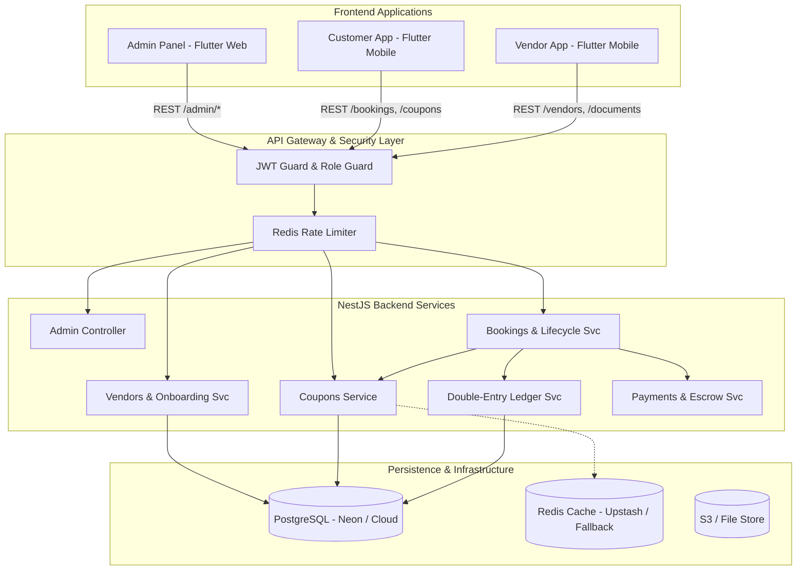

# DriveGo — Current System Architecture & Platform Topology

## 1. Executive Summary & System Mission
DriveGo is an end-to-end multi-sided car rental marketplace operating in India. The platform bridges three distinct user groups:
1. **Customers**: Search, compare, and book verified vehicles with doorstep delivery or hub pickup, transparent pricing, and instant coupon discounts.
2. **Vendors (Fleet Operators)**: Onboard their fleet, manage cars, track KYC compliance, fulfill handover/return inspections, and receive payouts calculated with double-entry accounting.
3. **Platform Administrators**: Supervise platform operations, review vendor onboarding compliance, manage service areas, audit ledger transactions, and configure system rules and marketing promotions.

---

## 2. Monorepo Topology & Project Structure
The repository is structured as a high-performance monorepo:

```
car_rental_monorepo/
├── car_rental_backend/                 # NestJS 10 REST & WebSocket API, Prisma ORM
│   ├── src/
│   │   ├── admin/                      # Admin controllers, audit logging, reports
│   │   ├── auth/                       # JWT auth, OTP flow, role guards, password hash
│   │   ├── bookings/                   # Booking state machine, trip extension, handover
│   │   ├── cars/                       # Fleet inventory, pricing packages, availability
│   │   ├── coupons/                    # Coupon validation, discount engine, usage limits
│   │   ├── ledger/                     # Double-entry bookkeeping engine & journal
│   │   ├── payments/                   # Razorpay webhook, escrow, escrow balance
│   │   ├── redis/                      # Redis cache, namespace constants, rate limiters
│   │   ├── reviews/                    # Rating & review system
│   │   ├── tracking/                   # Real-time vehicle telematics & socket gateway
│   │   └── vendors/                    # Vendor profile, multi-branch, onboarding compliance
│   └── prisma/schema.prisma            # Canonical PostgreSQL database schema
├── apps/
│   ├── admin_panel/                    # Flutter Web Admin Dashboard
│   │   ├── lib/core/router/            # GoRouter routing tree (/coupons, /vendors, etc.)
│   │   └── lib/features/               # Modular features (coupons, vendors, revenue, etc.)
│   ├── customer_app/                   # Flutter Mobile (iOS & Android) Customer Journey
│   │   └── lib/features/booking/       # Search, doorstep delivery, coupons, payment
│   └── vendor_app/                     # Flutter Mobile (iOS & Android) Vendor Operations
│       ├── lib/features/registration/  # Onboarding stepper, document upload, compliance
│       └── lib/features/fleet/         # Inventory, handover/return inspection, payouts
├── packages/
│   ├── core/                           # Shared ApiClient (Dio), TokenStorage, Theme
│   └── models/                         # Shared serialization models (Booking, Car, Vendor, etc.)
└── docs/                               # System matrices, architecture specifications, audits
```

---

## 3. Technology Stack

| Layer | Technologies / Frameworks |
| :--- | :--- |
| **Backend Engine** | NestJS 10, TypeScript 5, Node.js, Express, RxJS |
| **Database & ORM** | PostgreSQL 15, Prisma ORM 5.x |
| **Caching & In-Memory Store** | Redis (Upstash Serverless Cloud + fallback) |
| **Frontend Framework** | Flutter 3.x (Dart 3.x) targeting Web, Android, iOS |
| **State Management** | Flutter Riverpod 2.6.x (Notifier & AsyncNotifier pattern) |
| **Navigation & Routing** | GoRouter 14.x with declarative auth redirects |
| **Networking & API** | Dio 5.x with AuthQueuedInterceptor and TokenStorage |
| **Security & Encryption** | bcrypt, AES-256 bank detail encryption, JWT access/refresh |
| **Payment Gateway** | Razorpay Node SDK (Order creation, signature verification) |

---

## 4. Subsystem Deep-Dive

### 4.1 Server-Authoritative Pricing & Coupon Engine
- **Server Rule**: No client may calculate or dictate the final payable amount. The client sends parameters (`carId`, `startDate`, `endDate`, `tripType`, `deliveryType`, `couponCode`), and the server calculates the canonical quote.
- **Coupon Validation**:
  - Validates active status, expiry, per-user redemption limits, overall budget caps, minimum order amount, and applicable service areas/cities.
  - Supports `PERCENT` and `FLAT` discount types with `maxDiscount` caps.
  - Decrements available budget atomically and registers `CouponRedemption` in PostgreSQL.

### 4.2 Double-Entry Ledger & Financial Engine
- Every monetary movement creates balanced debits and credits across platform accounts:
  - `CUSTOMER_WALLET` / `GATEWAY_RECEIVABLE`
  - `PLATFORM_ESCROW`
  - `VENDOR_PAYABLE`
  - `PLATFORM_REVENUE_COMMISSION`
  - `PLATFORM_REVENUE_GST`
- Zero-sum verification: $\sum \text{Debits} = \sum \text{Credits}$ must hold for every journal entry, enforced by database constraints and transactional services.

### 4.3 Vendor Onboarding & Compliance Engine
- **Scope-Based Requirements**: Supports `GLOBAL`, `SERVICE_AREA`, `VEHICLE_CATEGORY`, and `VENDOR_SPECIFIC` requirement definitions.
- **Document Pipeline**: Auto-creates `Document` records from uploaded files (`RC_BOOK`, `TRADE_LICENSE`, `INSURANCE`) and links them to requirement fulfillment states.
- **Security Deposit**: Requires minimum refundable security deposit before fleet onboarding.
- **State Synchronization**: When an admin verifies a vendor (`PATCH /admin/vendors/:id/status`), the vendor app reacts on refresh and app resume (`WidgetsBindingObserver`), updating `vendorSessionProvider` and redirecting `/registration/pending` -> `/dashboard`.

### 4.4 Vehicle & Fleet Lifecycle
- Fleet status: `DRAFT` -> `AVAILABLE` -> `BOOKED` -> `IN_TRIP` -> `MAINTENANCE`.
- Digital Handover & Return Inspection:
  - Vendor and customer photo capture (odometer, fuel gauge, 4-corner exterior, interior).
  - Digital signatures with geo-stamping.
  - Automatic excess km and fuel charge calculation.

---

## 5. System Architecture & Wiring Diagram



---

## 6. Real-World Infrastructure & Service Status

| Service | Provider / Mechanism | Production Readiness State | Audit Notes |
| :--- | :--- | :--- | :--- |
| **Primary Database** | PostgreSQL via Prisma | **READY** | Full migrations, schema relations verified |
| **In-Memory Cache** | Upstash Serverless Redis | **BLOCKED (Quota)** | Software fully verified; Upstash free tier 500k limit reached |
| **Payment Gateway** | Razorpay SDK | **READY** | Webhook verification, mock fallback in dev |
| **SMS OTP** | Fast2SMS / In-memory | **READY** | In-memory dev fallback with full regex/expiry |
| **File Storage** | S3 / Local Multipart | **READY** | Local multipart fallback for offline development |
