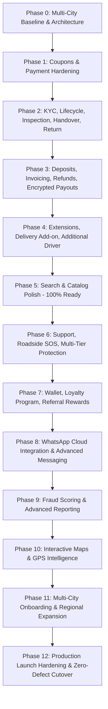

# DRIVEGO MASTER 36-FEATURE EXECUTION ROADMAP
**Platform:** DriveGo Full-Stack Rental Platform
**Target:** 36 Mandatory Product Features + Multi-City Expansion
**Date:** August 16, 2026

---

## 1. Phased Master Roadmap Overview

---

## 2. Phase-by-Phase Breakdown

### Phase 0–4: Completed & Production-Hardened (Features 1–14, 18–22, 26–29, 31, 33, 36)
- **Status:** **100% COMPLETE & VERIFIED**
- **Artifacts:**
  - Hardened Payment Verification & Reconciliation with PostgreSQL `SELECT ... FOR UPDATE` row locks.
  - Full Booking Lifecycle (`PENDING` $\rightarrow$ `CONFIRMED` $\rightarrow$ `HANDOVER_READY` $\rightarrow$ `ONGOING` $\rightarrow$ `RETURN_PENDING` $\rightarrow$ `COMPLETED`).
  - Customer Driving Licence KYC & Admin adjudication.
  - Inspection photo capture & OTP-based Handover/Return.
  - Dynamic Security Deposits with auto-release worker & Damage Claims settlement.
  - GST Tax Invoicing (SAC 998313, 18% GST).
  - Ongoing Trip Extensions with collision prevention and isolated payment order.
  - Secondary Additional Driver normalized entity with KYC checks.
  - AES-256-GCM Vendor bank encryption at rest with key rotation.
  - Multi-City isolation with city-specific trip-type enablement and pricing.
  - 39 / 39 backend test suites (273 unit tests), 10 / 10 customer Flutter tests, 0 analyzer errors.

---

### Phase 5: Search, Catalog & Discovery Polish (Features 20, 21, 22, 27, 28)
- **Status:** **PRODUCTION READY (A)**
- **Scope:** Month availability calendar, multi-attribute filter sheets, high-res photo gallery, wishlist, and recently viewed car carousels are fully operational.

---

### Phase 6: Customer Support, Roadside Assistance & Insurance (Features 15, 16, 17)
- **Target Scope:**
  1. **Feature 15 (Customer Support):** In-app support ticketing system (`SupportTicket`, `TicketMessage`), admin agent assignment, live chat WebSocket channel.
  2. **Feature 16 (Roadside Assistance):** Automated SOS dispatch engine, GPS location sharing, roadside assistance partner integration.
  3. **Feature 17 (Multi-Tier Insurance):** Protection tiers (`BASIC` included, `STANDARD` +₹250/day, `PREMIUM Zero-Dep` +₹500/day) with dynamic fee computation and deductible reductions.
- **Estimated Effort:** 1 Iteration.

---

### Phase 7: Growth & Retention — Wallet, Loyalty & Referrals (Features 23, 24, 25)
- **Target Scope:**
  1. **Feature 24 (DriveGo Wallet):** Double-entry ledger-backed wallet (`Wallet`, `WalletTransaction`), instant cancellation refund to wallet, wallet checkout deduction at payment boundary.
  2. **Feature 23 (Referral Program):** Unique referral codes, attribution tracking upon first completed rental, dual-sided wallet credits (₹500 referrer / ₹500 referee).
  3. **Feature 25 (Loyalty Program):** Points accrual (1 point per ₹100 spent), Tier thresholds (`Silver`, `Gold`, `Platinum`), tier discount perks and point redemption against rental fare.
- **Estimated Effort:** 1 Iteration.

---

### Phase 8: WhatsApp Business Cloud Integration (Feature 30)
- **Target Scope:**
  1. WhatsApp Cloud API client integration.
  2. Automated booking confirmation, OTP delivery, and PDF invoice delivery via WhatsApp.
  3. Customer 2-way interactive message templates.
- **Estimated Effort:** 0.5 Iteration.

---

### Phase 9: Analytics Intelligence & Fraud Risk Scoring (Features 32, 34)
- **Target Scope:**
  1. **Feature 32 (Advanced Analytics):** Exportable GST tax summaries, vendor cohort retention reports, city-wise revenue dashboards.
  2. **Feature 34 (Fraud & Risk Scoring):** Automated risk scoring engine (new customer velocity, high-value vehicle risk checks, duplicate identity heuristics).
- **Estimated Effort:** 0.5 Iteration.

---

### Phase 10: Interactive Maps & Location Intelligence (Features 26+, 35)
- **Target Scope:**
  1. Mapbox / Google Maps SDK embedded map widgets for car search.
  2. Interactive doorstep delivery pin-drop on map.
  3. Dynamic GPS distance-matrix calculation from vendor fleet hubs.
- **Estimated Effort:** 1 Iteration.

---

### Phase 11: Multi-City Expansion & Regional Onboarding (Feature 36+)
- **Target Scope:**
  1. Admin city onboarding portal: Configure city boundaries, localized GST state codes, localized commission configs, and per-city deposit rules.
  2. Regional vendor recruitment & automated branch onboarding.
- **Estimated Effort:** 0.5 Iteration.

---

### Phase 12: Pre-Launch Zero-Defect Production Cutover
- **Target Scope:**
  1. End-to-end multi-app staging smoke tests.
  2. Load & stress tests on booking concurrency and payment reconciliation.
  3. Final database migration verification and zero-downtime Render deployment.

---

## 3. Multi-City Expansion Blueprint

1. **City-Specific Entities (First-Class Isolation):**
   - Every `Vendor`, `Car`, `DepositRule`, `CommissionConfig`, and `Coupon` is strictly tagged with `city`.
   - `SupportedCity.enabledTripTypes` controls trip type availability per city (`SELF_DRIVE`, `OUTSTATION` active; `LOCAL`, `AIRPORT_TRANSFER` coming soon).
2. **Expansion to New Indian Cities:**
   - Onboarding a new city (e.g. Pune, Bangalore, Hyderabad) requires **0 code changes**.
   - Admin creates a `SupportedCity` entry $\rightarrow$ configures commission and deposit rules $\rightarrow$ vendors register vehicles $\rightarrow$ immediately live for customer search.
3. **International / Multi-Country Readiness:**
   - Schema uses standard ISO currency fields (`INR`), dynamic country tax identifiers (`gstNumber`), and UTC timestamps (`DateTime`). Expanding to overseas jurisdictions only requires localization bundles and currency provider hooks.

---

## 4. Financial Safety & Anti-Fraud Invariants

1. **Authoritative Pricing:** Fare components, discounts, deposits, and fees are calculated server-side in NestJS services. Client requests only submit entity IDs.
2. **Double-Spend & Concurrency Protection:** PostgreSQL `SELECT ... FOR UPDATE` row locks prevent simultaneous booking collisions, double coupon redemptions, and conflicting extensions.
3. **Immutability of Financial Snapshots:** `Payment`, `Invoice`, and `SecurityDeposit` records preserve point-in-time rates and amounts.
4. **Idempotency:** Payment verification, refund processing, and reconciliation workers execute idempotently with transaction guards.
5. **Zero-Trust Document Access:** Customer driving licence photos, vendor RC books, and dispute evidence are signed and restricted via authenticated upload URLs.
