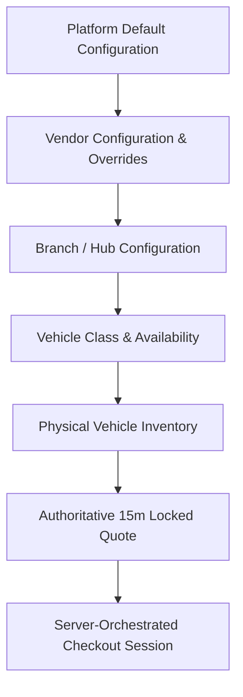
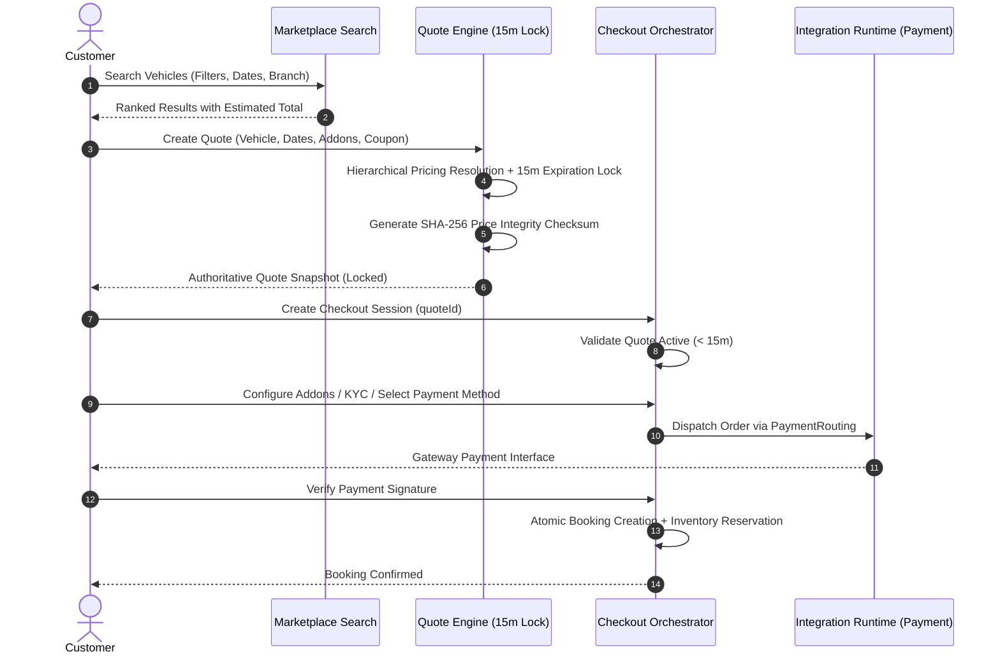

# DriveGo — Phase M: Enterprise Rental Marketplace, Discovery & Booking Experience Engine

## 1. Architectural Overview & Domain Boundaries

Phase M elevates DriveGo from a core rental execution engine into a genuinely scalable, multi-tenant, multi-vendor, multi-branch **Enterprise Rental Marketplace**. The architecture decouples discovery, ranking, quoting, checkout orchestration, promotions, and ancillary add-on products from low-level physical vehicle and payment implementations.

### 1.1 Marketplace Core Hierarchy

The marketplace models inventory and capabilities through a hierarchical abstraction:

Every tier supports overrides without business-logic duplication:
- **Pricing & Multipliers**: Platform Base $\to$ Vendor Rates $\to$ Branch Overrides $\to$ Vehicle Class Rates
- **Promotions & Offers**: Platform Campaigns $\to$ Vendor-Exclusive Coupons $\to$ Branch Offers $\to$ Stacking Policies
- **Ancillaries & Protection**: Platform Catalog $\to$ Vendor-Specific Addons $\to$ Branch-Level Availability
- **Cancellation & Refunds**: Platform Tier Matrix $\to$ Vendor Overrides $\to$ Branch Overrides $\to$ Class Restrictions

---

## 2. Enterprise Marketplace Search Engine

Rather than relying on naive database queries, the marketplace search engine (`MarketplaceSearchService`) aggregates multi-vendor inventory and applies multi-dimensional faceted filtering alongside deterministic real-time availability guards.

### 2.1 Faceted Filter Dimensions

| Filter Category | Parameters Supported | Architectural Behavior |
| :--- | :--- | :--- |
| **Location & Fulfillment** | `pickupLocation`, `pickupBranchId`, `returnLocation`, `returnBranchId` | Supports round-trip and one-way rentals across distinct branch hubs. Calculates inter-branch relocation fees. |
| **Schedule & Duration** | `startDate`, `endDate`, `tripType` | Evaluates hourly and multi-day rentals, checks chronological validity, and applies duration tier discounts (weekly/monthly). |
| **Vehicle Specifications** | `vehicleClass` (`CarCategory`), `transmission`, `fuelType`, `minSeats`, `minLuggage`, `isElectric` | Resolves available vehicle models, seating capacity, AC/features, battery range (EV), and luggage limits. |
| **Commercial & Trust** | `minPrice`, `maxPrice`, `vendorIds`, `minRating`, `instantConfirmation` | Multi-vendor aggregation, minimum vendor rating thresholds, verified vendor filtering, and instant booking flags. |
| **Distance & Driving** | `unlimitedDistance`, `minDriverAge` | Evaluates mileage policies (daily allowance vs unlimited), extra km rate, and legal age minimums. |

### 2.2 Real-Time Availability Intelligence

Marketplace search does not advertise inventory that cannot actually be fulfilled:
1. Validates against active reservations (`CONFIRMED`, `ONGOING`, `PENDING`).
2. Enforces a **60-minute turnaround buffer** between consecutive rentals for vehicle cleaning, inspection, and compliance checks.
3. Respects temporary checkout holds (`VehicleHold`) and active maintenance/accident blocks (`VehicleBlock`).
4. Ensures race-condition safe allocation slack so peak demand does not cause double-booking collisions.

---

## 3. Intelligent Weighted Search Result Ranking

Search candidates are scored deterministically using a multi-factor weighted algorithm (`MarketplaceRankingService`).

### 3.1 Composite Scoring Formula

$$\text{Composite Score} = \left( w_p \cdot S_{\text{price}} + w_a \cdot S_{\text{avail}} + w_v \cdot S_{\text{vendor}} + w_d \cdot S_{\text{dist}} + w_r \cdot S_{\text{readiness}} + w_h \cdot S_{\text{health}} \right) \times 100$$

Where factor scores ($0.0 \le S_k \le 1.0$) are defined as:
- **Price Competitiveness ($S_{\text{price}}$)**: Normalized inverted price relative to the current candidate pool. Cheaper candidates score closer to 1.0.
- **Availability Confidence ($S_{\text{avail}}$)**: Ratio of available vehicles in branch inventory to peak buffer threshold.
- **Vendor Reliability ($S_{\text{vendor}}$)**: Weighted composite of vendor rating ($0 - 5.0$) and verified subscription tier bonus.
- **Branch Proximity ($S_{\text{dist}}$)**: Inverted Haversine distance from customer coordinates to pickup hub (or delivery bonus).
- **Vehicle Readiness ($S_{\text{readiness}}$)**: Recency of vehicle model year and instant confirmation capability.
- **Inventory Health ($S_{\text{health}}$)**: Slack ratio mitigating inventory pressure at high-demand hubs.

### 3.2 Pluggable Ranking Strategies

The ranking engine follows the **Strategy Pattern** with interchangeable implementations:
1. `BalancedRankingStrategy` (Default): $w_p=0.25, w_a=0.20, w_v=0.20, w_d=0.15, w_r=0.10, w_h=0.10$
2. `PriceFirstRankingStrategy`: $w_p=0.55, w_a=0.15, w_v=0.15, w_d=0.05, w_r=0.05, w_h=0.05$
3. `VendorReliabilityRankingStrategy`: $w_v=0.45, w_p=0.15, w_a=0.15, w_d=0.10, w_r=0.10, w_h=0.05$
4. `ProximityRankingStrategy`: $w_d=0.45, w_p=0.15, w_a=0.15, w_v=0.15, w_r=0.05, w_h=0.05$

Badges (`BEST_VALUE`, `TOP_RATED`, `ELECTRIC`, `INSTANT_CONFIRM`, `POPULAR`) are automatically assigned based on scoring thresholds.

---

## 4. Search $\to$ Quote $\to$ Checkout Consistency

An enterprise invariant: **The price displayed in marketplace search must never silently change during checkout.**

### 4.1 Quote Lock & Tamper-Proof Invariants
- **Strict 15-Minute Expiration**: Quotes are locked in `BookingQuote` with `status: ACTIVE` and `expiresAt = now + 15m`.
- **Cryptographic Checksum**: SHA-256 hash computed over `carId:startDate:endDate:subtotal:discountTotal:feesTotal:taxTotal:depositTotal:totalPayable`. Tampering or unauthorized mutations are rejected.
- **Zero Silent Mutation**: If a quote expires during checkout, the client is forbidden from proceeding without an explicit `refreshQuote()` call that re-evaluates current rates and notifies the customer.

---

## 5. Promotions & Discount Engine

The `PromotionEngineService` executes multi-tenant coupon validation with rigorous invariants:
- **Tenant / Vendor Scoping**: Coupons can be platform-wide (`vendorId: null`) or vendor-exclusive. Cross-vendor attempts are rejected.
- **Branch Restrictions**: Geographically scoped offers valid only at designated hubs.
- **Vehicle Class Scope**: Discounts restricted to specific categories (e.g. `SUV`, `LUXURY`).
- **Quota Limits**: Global usage caps (`globalUsageLimit`) and per-customer limits (`perCustomerLimit`).
- **First-Booking Protection**: Enforces `firstBookingOnly` by inspecting customer historical completed rentals.
- **Minimum Duration & Booking Amount**: Enforces threshold spend and minimum rental days.
- **Anti-Stacking Rules**: Non-stackable coupons cannot be combined with existing duration discounts or other promotions.

---

## 6. Optional Products & Ancillaries Architecture

Optional products (`AncillaryProductsService`) are maintained as structured catalog items rather than ad-hoc flags:

| Add-on Code | Name | Pricing Model | Category |
| :--- | :--- | :--- | :--- |
| `ADDITIONAL_DRIVER` | Additional Authorised Driver | `PER_DAY` | `DRIVER` |
| `CHILD_SAFETY_SEAT` | Infant / Child Safety Seat | `PER_DAY` | `CHILD_SEAT` |
| `GPS_NAVIGATION` | Dedicated GPS Navigator | `FLAT` | `GPS` |
| `ROADSIDE_ASSISTANCE` | 24/7 Premium Roadside Assistance | `FLAT` | `ROADSIDE_ASSISTANCE` |
| `ZERO_DEP_PROTECTION` | Zero-Deductible Damage Waiver | `PER_DAY` | `PROTECTION` |
| `EV_FAST_CHARGING_PASS` | Unlimited High-Speed EV Pass | `FLAT` | `EV_PACKAGE` |
| `DOORSTEP_DELIVERY` | Doorstep Handover & Return | `FLAT` | `DELIVERY` |
| `POST_TRIP_CLEANING` | Express Cleaning Waiver | `FLAT` | `CLEANING` |

Pricing is computed dynamically based on duration, quantity, and tax rates (18% GST), and integrated seamlessly into `BookingQuoteLineItem` (`EXTRA_ADDON`).

---

## 7. Customer Checkout Orchestration & Payment Resilience

The `CheckoutOrchestratorService` governs the stateful customer journey via an explicit state machine:

$$\text{DRAFT} \longrightarrow \text{QUOTE\_LOCKED} \longrightarrow \text{PAYMENT\_PENDING} \longrightarrow \text{CONFIRMED}$$
$$\text{PAYMENT\_PENDING} \xrightarrow{\text{Failure}} \text{PAYMENT\_FAILED} \xrightarrow{\text{Safe Retry}} \text{PAYMENT\_PENDING}$$

### 7.1 Double-Debit Prevention & Gateway Failover Safety

When a payment attempt fails, the platform classifies the failure via `PaymentRoutingService.evaluateFallbackSafety`:
1. **Post-Dispatch Indeterminate State (Timeout / Network Drop)**:
   - If the payment request was already dispatched to the external gateway and the response is timed out or unknown, **blind failover is strictly forbidden**.
   - Transitioning to another gateway could charge the customer twice.
   - Action: Flag session as `PENDING_RECONCILIATION` and initiate asynchronous gateway verification.
2. **Pre-Flight Failure (Circuit Open / Rate Limited / Gateway Maintenance)**:
   - Safe to failover immediately to the secondary gateway in the pre-computed `fallbackChain` (e.g. `razorpay` $\to$ `stripe` $\to$ `cashfree`).
3. **Customer Actionable Decline (Card Declined / Insufficient Funds)**:
   - Preserve quote lock and prompt customer to select an alternative payment method without invalidating the checkout session.

---

## 8. Data-Driven Cancellation Policy Foundation

The `CancellationPreviewService` resolves hierarchical cancellation matrices:
- **Free Cancellation Window**: Full 100% fare refund and 100% deposit refund if cancelled $> 24$ hours prior to scheduled departure.
- **Moderate Fee Tier**: 25% cancellation fee between 6 hours and 24 hours prior to departure.
- **Late Cancellation Tier**: 50% cancellation fee within 6 hours of departure.
- **Post-Commencement Tier**: 100% non-refundable after scheduled departure time.
- **Deposit Guarantee**: 100% of the refundable security deposit is preserved and refunded regardless of fee tier if vehicle handover did not take place.

---

## 9. Telemetry, Observability & Security

- **Multi-Tenant Isolation**: Server-enforced vendor scoping on every query and mutation. One vendor cannot view another vendor's operational data, margins, or quotes.
- **Sensitive Data Masking**: PII minimization across customer and driver documents. Payment cards, credentials, and tokens are never logged or persisted in plaintext.
- **Idempotency**: All order dispatch and booking creation requests enforce idempotency keys, preventing duplicate records on network retries.

---

## 10. Automated Verification & Test Results

| Subsystem / Test Suite | Tests Passed | Status | Coverage Areas |
| :--- | :--- | :--- | :--- |
| **`phase-m-marketplace.spec.ts`** | **17 / 17** | **PASS** | Multi-vendor search, faceted counts, weighted ranking, quote lock, promotions, ancillaries, checkout lifecycle, double-debit guard, cancellation preview. |
| **`phase-l-rental-core.spec.ts`** | **14 / 14** | **PASS** | Hierarchical pricing resolution, class availability, turnaround buffer, digital handover, allocation history. |
| **`phase-l-enterprise-payment-ecosystem.spec.ts`** | **34 / 34** | **PASS** | Payment provider routing, capability discovery, circuit breakers, rate limiting, adapters (Razorpay, Stripe, Cashfree, PayU, PhonePe, Adyen). |
| **Full Backend Test Suite (`npm test`)** | **1,253 / 1,253** | **PASS** | 113 test suites across authentication, fleet, pricing, bookings, integrations, operations, and marketplace. Zero regressions. |
| **Backend Build (`npm run build`)** | **Clean** | **PASS** | 0 TypeScript errors. |
| **Flutter Analyze (`3 items`)** | **Clean** | **PASS** | 0 issues across `customer_app`, `vendor_app`, and `admin_panel`. |
| **Admin Panel Tests (`flutter test`)** | **57 / 57** | **PASS** | Governance dashboards, pricing control, operational telemetry, and life cycle audit. |

---

## 11. Extension Points for Future Intelligence

1. **Demand Forecasting & Surge Pricing**: Hook directly into `MarketplaceRankingService` and `RentalPricingResolutionService` via pluggable `SurgePricingStrategy` based on branch occupancy rates.
2. **ML Recommender System**: Replace `BalancedRankingStrategy` with personalized collaborative filtering without modifying the search engine core.
3. **Automated Inventory Rebalancing**: Utilize facet demand signals to trigger automated branch-to-branch fleet transfer recommendations.
