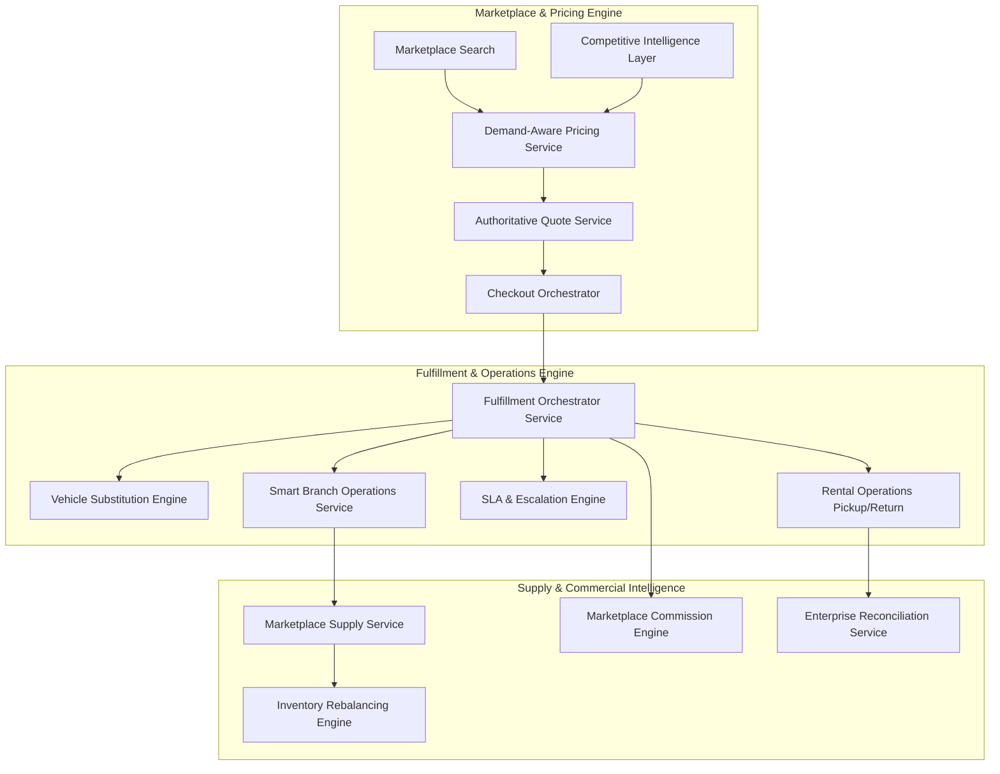

# DriveGo / PlayHub — Phase N: Enterprise Fulfillment, Pricing Intelligence & Marketplace Operations Implementation Plan

**Date**: 2026-09-09  
**Version**: 1.0.0-enterprise  
**Lead Architect**: Senior Principal Software Architect & Staff Systems Engineer  

---

## 1. Architectural Objectives & Invariants

Phase N evolves DriveGo from a marketplace discovery/checkout system into an end-to-end operational fulfillment and commercial intelligence engine.

### Non-Negotiable Invariants:
1. **Zero State Collapsing**: A booking's financial status (`CONFIRMED`, `PAID`) must never be conflated with its ground fulfillment status (`PREPARATION_PENDING`, `VEHICLE_READY`, `CUSTOMER_ARRIVED`).
2. **Deterministic Vehicle Substitution**: When an allocated vehicle is disabled (breakdown, maintenance, late return), the system must never silently swap cars or charge the customer without a recorded audit decision (`VehicleSubstitutionRecord`).
3. **Bounded Dynamic Pricing**: Demand pricing must be strictly bounded by deterministic policy guardrails (`minPrice`, `maxPrice`, `maxSurgeMultiplier`, `coolingWindow`). Uncontrolled or opaque rate spikes are strictly forbidden.
4. **Provider Decoupling**: External market intelligence and competitor pricing providers must implement normalized contracts (`ICompetitivePriceProvider`). Core pricing services must have zero direct vendor coupling.
5. **Multi-Tenant Isolation**: Every operational queue, fulfillment task, substitution, SLA rule, and commission breakdown must enforce tenant (`vendorId`) and branch (`branchId`) boundaries.
6. **Zero Price Drift & Financial Integrity**: Marketplace quotes, line-item breakdowns, and commission splits must remain immutable and mathematically sound ($\text{Platform Fee} + \text{Vendor Net} + \text{Branch Fee} + \text{Gateway Fee} = \text{Subtotal} + \text{Taxes} - \text{Discounts}$).
7. **Zero Test Regressions**: All 1,253 existing backend tests must stay green alongside comprehensive new Phase N test suites.

---

## 2. Component Architecture & Detailed Work Breakdown

### Component 1: Database Schema Expansion (`schema.prisma` & Migration)
- Migration: `20260910100000_add_enterprise_fulfillment_and_marketplace_operations`
- New Enums:
  - `FulfillmentStage`: `PENDING_ALLOCATION`, `ALLOCATED`, `PREPARATION_SCHEDULED`, `PREPARATION_IN_PROGRESS`, `CLEANING_COMPLETED`, `INSPECTION_COMPLETED`, `READY_FOR_PICKUP`, `CUSTOMER_CHECKED_IN`, `HANDOVER_IN_PROGRESS`, `ACTIVE_RENTAL`, `RETURN_INSPECTION_PENDING`, `SETTLEMENT_PENDING`, `COMPLETED`, `CANCELLED`
  - `SubstitutionDecision`: `AUTO_SUBSTITUTE`, `MANUAL_SUBSTITUTE`, `CUSTOMER_APPROVAL_REQUIRED`, `UPGRADE_REQUIRED`, `NO_ALTERNATIVE`
  - `SubstitutionReason`: `MECHANICAL_BREAKDOWN`, `SCHEDULED_MAINTENANCE`, `ACCIDENT_DAMAGE`, `CLEANING_DELAY`, `GPS_TELEMATICS_FAILURE`, `LATE_RETURN_OVERLAP`, `COMPLIANCE_HOLD`, `ADMIN_OVERRIDE`
  - `SlaSeverity`: `INFO`, `WARNING`, `CRITICAL`, `EMERGENCY`
  - `InventoryTransferStatus`: `PROPOSED`, `APPROVED`, `DISPATCHED`, `IN_TRANSIT`, `RECEIVED`, `CANCELLED`
  - `SalesChannel`: `CUSTOMER_APP`, `WEB_MARKETPLACE`, `VENDOR_DIRECT`, `BRANCH_DESK`, `ADMIN_PORTAL`, `CORPORATE_B2B`, `AFFILIATE_PARTNER`
- New Models:
  - `FulfillmentRecord`
  - `VehicleSubstitutionRecord`
  - `DynamicPricingPolicy`
  - `CompetitorPriceObservation`
  - `InventoryTransferRecommendation`
  - `SlaPolicyDefinition`
  - `SlaBreachIncident`
  - `MarketplaceCommissionRule`
  - `CorporateAccount`

### Component 2: Fulfillment Orchestration Layer (`car_rental_backend/src/fulfillment`)
- `FulfillmentOrchestratorService`:
  - Central orchestrator coordinating booking transitions with ground operations.
  - Tracks vehicle turnaround preparation (cleaning, maintenance check, readiness).
  - Tracks customer arrival (branch desk check-in queue).
  - Emits normalized domain events: `BOOKING_CONFIRMED`, `ALLOCATION_CREATED`, `VEHICLE_PREPARATION_STARTED`, `VEHICLE_READY`, `CUSTOMER_ARRIVED`, `RENTAL_STARTED`, `RETURN_COMPLETED`, `SETTLEMENT_COMPLETED`.

### Component 3: Vehicle Substitution Engine (`car_rental_backend/src/fleet`)
- `VehicleSubstitutionEngine`:
  - Invoked when an allocated vehicle is marked `MAINTENANCE`, `SUSPENDED`, or delayed by past rental return.
  - Multi-factor candidate scoring:
    - Same vehicle class vs 1-tier upgrade.
    - Same vendor vs affiliated partner.
    - Same branch vs nearest branch with transfer feasibility.
    - Model year and feature equivalence.
  - Decision rules:
    - If exact class available at same branch $\to$ `AUTO_SUBSTITUTE` (zero fee delta).
    - If higher class available at same branch $\to$ `UPGRADE_REQUIRED` (free upgrade to customer).
    - If car at neighboring branch within radius $\to$ `MANUAL_SUBSTITUTE` or `CUSTOMER_APPROVAL_REQUIRED`.
    - If no vehicle available $\to$ `NO_ALTERNATIVE` with automated SLA critical escalation.
  - Persists immutable `VehicleSubstitutionRecord`.

### Component 4: Demand-Aware Pricing Engine (`car_rental_backend/src/pricing`)
- `DemandAwarePricingService`:
  - Implements `IPricingStrategyModel`.
  - Calculates real-time dynamic multipliers:
    $$\text{Dynamic Rate} = \text{Base Rate} \times M_{\text{util}} \times M_{\text{velocity}} \times M_{\text{lead}} \times M_{\text{comp}}$$
  - Clamps output strictly between `minDailyPrice` and `maxDailyPrice`, subject to `maxSurgeMultiplier` (e.g. 1.5x max surge).
  - Provides explainable factor breakdown for every quote line item.

### Component 5: Competitive Price Intelligence Layer (`car_rental_backend/src/pricing/competitor`)
- `CompetitivePricingService`:
  - Decoupled provider interface `ICompetitivePriceProvider`.
  - Normalized ingestion of market rates by city, vehicle class, and rental duration.
  - Aggregates market price indices and computes relative market competitiveness score ($S_{\text{comp}}$).

### Component 6: Marketplace Supply & Automated Rebalancing (`car_rental_backend/src/fleet`)
- `MarketplaceSupplyService`:
  - Real-time supply analytics across branches: total, available, on-rent, maintenance, cleaning, blocked inventory.
  - Computes branch utilization index and demand-to-supply ratios.
- `InventoryRebalancingEngine`:
  - Identifies branch inventory skews (e.g., Branch A SUV deficit > 30%, Branch B SUV surplus > 40%).
  - Generates `InventoryTransferRecommendation` with expected ROI, transfer logistics cost, and confidence rating.

### Component 7: Smart Branch Operations Dashboard (`car_rental_backend/src/operations/branch`)
- `BranchOperationsService`:
  - Real-time operational queues for branch personnel:
    1. Pickup Queue: scheduled pickups, KYC readiness, vehicle readiness.
    2. Return Queue: expected returns, overdue alerts.
    3. Preparation Queue: vehicles needing cleaning or maintenance checks.
    4. Inspection Queue: pending pre-trip and post-trip digital inspections.
    5. Staff Workload & Turnaround SLA tracking.

### Component 8: SLA & Escalation Engine (`car_rental_backend/src/operations/sla`)
- `SlaEscalationEngine`:
  - Evaluates operational timeouts:
    - Allocation SLA: booking unallocated $> 15$ mins.
    - Readiness SLA: vehicle not ready $< 60$ mins prior to pickup.
    - Customer Wait SLA: customer checked in at desk $> 10$ mins without handover.
    - Overdue SLA: vehicle return $> 30$ mins past grace period.
  - Escalates across 4 tiers (`INFO`, `WARNING`, `CRITICAL`, `EMERGENCY`) and dispatches outbox notifications.

### Component 9: Marketplace Commission & Commercial Engine (`car_rental_backend/src/finance/commission`)
- `MarketplaceCommissionService`:
  - Multi-tier rule evaluation: Platform $\to$ Vendor $\to$ Branch $\to$ Vehicle Class $\to$ Sales Channel.
  - Produces immutable multilateral financial breakdowns:
    - Platform Commission
    - Vendor Payable
    - Branch Operations Share
    - Gateway Processing Fee
    - Promotional Subsidy
    - GST / Taxes
    - Net Payout

### Component 10: Admin & Vendor Command Centers (`car_rental_backend/src/operations/command-center`)
- Admin Command Center API: real-time global health across all branches and vendors.
- Vendor Operations Center API: isolated multi-tenant view of vendor bookings, fleet queues, SLAs, and revenue.

---

## 3. Step-by-Step Implementation Sequence

1. **Step 1: Prisma Schema & Migration**
   - Add new models, enums, and relations in `schema.prisma`.
   - Create SQL migration `prisma/migrations/20260910100000_add_enterprise_fulfillment_and_marketplace_operations/migration.sql`.
   - Run `npx prisma generate` and validate with `npx prisma validate`.
2. **Step 2: Core Fulfillment Engine & Domain State Machine**
   - Implement `FulfillmentRecord` state machine and `FulfillmentOrchestratorService`.
   - Integrate with `RentalOperationsService` and `BookingLifecycleService`.
3. **Step 3: Vehicle Substitution Engine**
   - Implement `VehicleSubstitutionEngine` with the 5 decision paths and candidate scoring.
4. **Step 4: Demand-Aware Pricing & Competitive Intelligence**
   - Implement `DemandAwarePricingService` and `CompetitivePricingService` with policy safety clamps.
5. **Step 5: Marketplace Supply & Smart Branch Operations**
   - Implement `MarketplaceSupplyService`, `InventoryRebalancingEngine`, and `BranchOperationsService`.
6. **Step 6: SLA & Escalation Engine**
   - Implement `SlaEscalationEngine` with 4-tier alerting and task creation.
7. **Step 7: Marketplace Commission & Financial Operations**
   - Implement `MarketplaceCommissionService` and multi-tier fee resolution.
8. **Step 8: Admin & Vendor Command Center Controllers**
   - Implement endpoints under `/api/v1/fulfillment`, `/api/v1/operations/branch`, and `/api/v1/operations/command-center`.
9. **Step 9: Test Suite Creation & Verification**
   - Create `test/phase-n-enterprise-fulfillment.spec.ts`.
   - Run targeted tests and full backend test suite (`npm test`).
   - Run Flutter verification (`flutter analyze` and `flutter test`).
10. **Step 10: Documentation & Mandatory Git Checkpoint**
    - Create `docs/phase-n-enterprise-fulfillment-and-marketplace-operations.md`.
    - Commit and push to `origin/main`.
