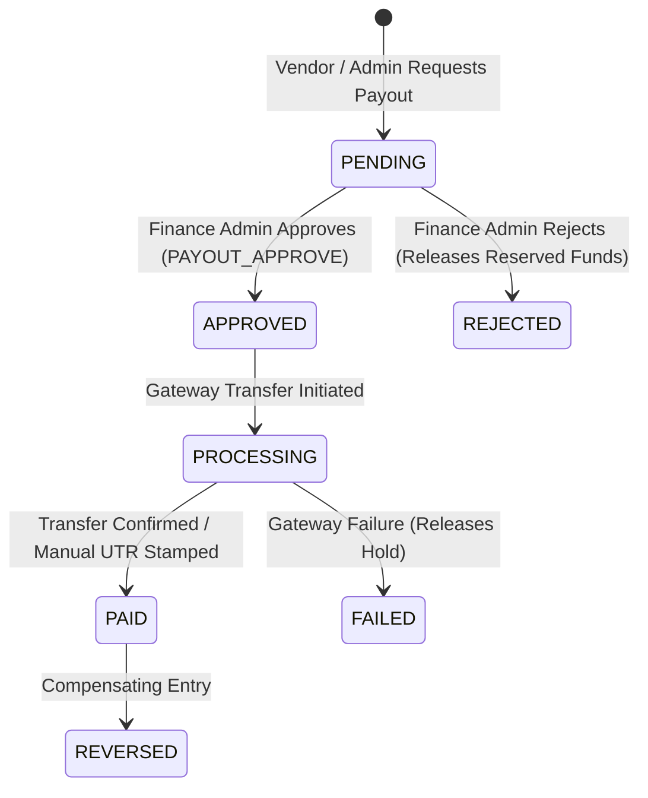

# Phase 27.6: Finance, Vendor Payouts, Reconciliation & Marketplace Money Operations

## 1. Executive Summary
Phase 27.6 hardens and completes the production financial infrastructure for DriveGo. Every monetary mutation across booking payments, customer wallet transactions, promotional credits, security deposits, vendor payables, automated reconciliations, and financial adjustments is strictly server-authoritative, idempotent, auditable, and traceable via double-entry ledger entries.

---

## 2. Core Architecture & Financial Safeguards

### A. Authoritative Ledger & Double-Entry Integrity
1. **Wallet Ledger**: Immutable `WalletLedgerEntry` tracking real money vs promo credits, debits, credits, expiration, and idempotency keys.
2. **Vendor Payable Balance**: Server-side calculation dynamically deducting settlement hold periods (`settlementHoldDays`), paid payouts, and pending/approved reserved payouts.
3. **Financial Adjustments**: Immutable `FinancialAdjustment` records for manual operator interventions (Goodwill, Damage Compensation, Dispute Settlement, Commission Correction, Penalty Waiver) with dual ledger updates and audit logs.

### B. Vendor Payout Lifecycle & Separation of Duties

### C. SystemConfig Governance Limits
- `minPayoutAmount`: ₹500
- `maxSinglePayoutAmount`: ₹100,000
- `dailyVendorPayoutCap`: ₹200,000
- `payoutApprovalThreshold`: ₹25,000 (Requires 2-step approval above threshold)
- `settlementHoldDays`: 2 days (Safety buffer post trip completion for damage/dispute reviews)

### D. Concurrency & Idempotency Safeguards
1. **Vendor Row Locking**: Concurrent payout requests serialize using PostgreSQL `SELECT id FROM "Vendor" WHERE id = $1 FOR UPDATE`.
2. **Refund Bounding**: Partial refunds validate `refundAmount <= (payment.amount - payment.refundAmount)` to prevent double refunding.
3. **Deterministic Idempotency**: Permanent deduplication via unique index on `idempotencyKey` across payouts, payments, refunds, and adjustments.

---

## 3. Verification & Test Metrics
- **Backend Test Suites**: 74/74 passed (548/548 individual tests passed, 100%)
- **NestJS Compilation**: 0 errors (`nest build` passed cleanly)
- **Flutter Static Analysis**: 0 issues across monorepo (`flutter analyze`)
- **Flutter Test Suites**:
  - `customer_app`: 88/88 passed
  - `vendor_app`: 17/17 passed
  - `admin_panel`: 11/11 passed
