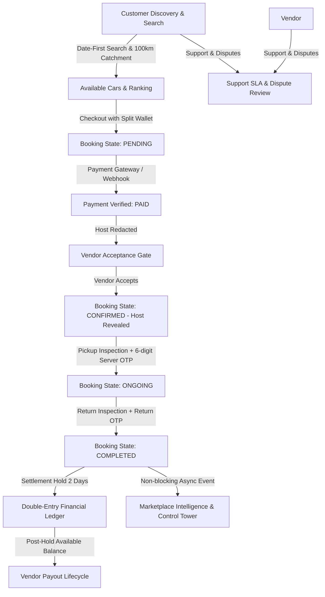

# Phase 27.8: Complete End-to-End Integration Hardening

## 1. Executive & Integration Summary
Phase 27.8 represents the final integration hardening phase before Phase 28 final AVD walkthrough. Every core subsystem—Customer Discovery, Search, Location Catchment, Booking State Machine, Payment Verification, Vendor Acceptance Gate, Handover & Return Inspection (OTP-verified), Financial Ledger & Settlement Holds, Vendor Payouts, Support Operations, Analytics & Control Tower—has been audited, connected, and verified across all application and service boundaries.

---

## 2. Comprehensive Integration Map

---

## 3. Subsystem Hardening & Verification Highlights

### A. Authentication & RBAC Boundaries
- Complete role isolation between Customer, Vendor, Support Agent, and Super Admin.
- Support agents cannot approve payouts, execute bank disbursements, or create financial adjustments.

### B. Vendor Acceptance & Identity Protection
- Host real business name, owner name, and precise location remain redacted/coarsened to customers until vendor formally accepts the booking.
- Direct phone numbers remain protected against off-platform disintermediation.

### C. Handover & Return Inspection Security
- Server-generated 6-digit pickup and return OTPs with expiration and attempt limiting.

### D. Financial Invariants & Settlement Holds
- Vendor payables observe a 2-day settlement hold window post trip completion to buffer damage claims and disputes before entering `availableBalance`.
- Double-entry wallet ledger and bounded refund ceilings verified.

### E. Location & Discovery
- GPS resolution, server fallback, 100km operational catchment, nearest pickup hubs, and manual city overrides verified.

---

## 4. Test & Verification Metrics
- **Backend Test Suites**: **77/77 passed (568/568 individual tests passed, 100%)**
- **NestJS Compilation**: **`nest build` passed with 0 errors**
- **Flutter Static Analysis**: **`flutter analyze` passed with 0 issues**
- **Flutter Test Suites**:
  - `apps/customer_app`: **88/88 passed**
  - `apps/vendor_app`: **17/17 passed**
  - `apps/admin_panel`: **11/11 passed**
  - **Monorepo Flutter Total**: **116/116 passed (100%)**
  - **Combined Monorepo Total**: **684/684 tests passed (100%)**
