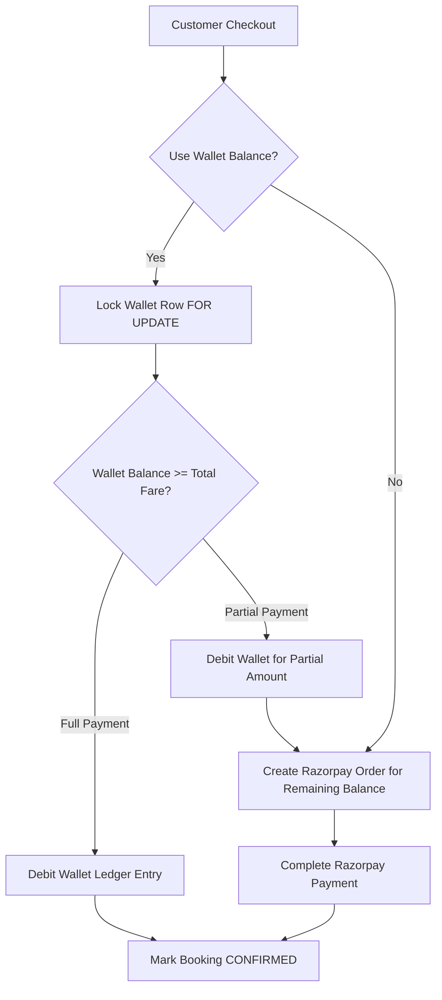

# DRIVEGO PHASE 7 PRE-IMPLEMENTATION AUDIT
**Scope:** Feature 23 (Referral Program) + Feature 24 (DriveGo Wallet) + Feature 25 (Loyalty Program)
**Execution Date:** August 16, 2026
**Auditor:** Senior Principal Engineer, CTO, Security Architect, Payments Architect & Product Reviewer
**Audit Mode:** STRICT READ-ONLY (No Source Code or Database Mutations)
**Benchmark Booking Safety:** `cmsu5sk3m000qgw1zaf9ftksz` (CONFIRMED / PAID / refundStatus: NONE — Verified Untouched)

---

## 1. Executive Summary & Master Status

| Feature ID | Feature Name | Master Status | Architectural Dependency |
| :---: | :--- | :---: | :--- |
| **24** | **DriveGo Wallet** | **MISSING** | **FOUNDATION (Must be built 1st)** |
| **23** | **Referral Program** | **MISSING** | **CONSUMER (Hooks into Wallet Ledger)** |
| **25** | **Loyalty Program** | **MISSING** | **CONSUMER / SEPARATE POINTS DOMAIN (Convertible to Wallet via auditable transaction)** |

### Core Architectural Principle
**BUILD THE WALLET FINANCIAL LEDGER FIRST.**
1. Referral rewards and loyalty conversions must **never** directly mutate a mutable balance field.
2. All monetary credits and debits must pass through an authoritative, append-only, immutable **Wallet Financial Ledger** with strict row-level pessimistic locking (`SELECT ... FOR UPDATE`), cryptographic idempotency keys, and full balance verification.
3. Money (INR) and Loyalty Points are **distinct accounting domains**. Points cannot directly pay for trips; points must be converted to Wallet balance via an explicit, auditable, atomic transaction or redeemed as structured discounts.

---

## 2. Part A — Repository Audit

### A.1 Database & Migrations
- **Current Prisma Schema:** 978 lines, 27 models, 17 enums.
- **Migration History:** 17 formal Prisma migrations in `car_rental_backend/prisma/migrations/`.
- **Existing User Model:** Has `phone`, `email`, `role`, `banned`, relations to bookings, kyc, invoices, support tickets, notifications. Does **not** have `referralCode`, `wallet`, or `loyaltyAccount`.
- **Existing Financial Engine:**
  - `Payment`: Razorpay order/payment/refund bindings with server-side signature validation.
  - `Invoice` & `CreditNote`: Immutable financial snapshots with 18% GST itemization.
  - `SecurityDeposit`: Independent escrow tracking held and refunded via Razorpay.
  - `Coupon` & `CouponUsage`: Pessimistic row-locked (`SELECT ... FOR UPDATE`) discount application with single-use customer constraints.
  - `Dispute` & `DamageClaim`: Deductions against held security deposits with admin adjudication.
- **Benchmark Booking:** `cmsu5sk3m000qgw1zaf9ftksz` — Status `CONFIRMED`, Payment `PAID`, refundStatus `NONE` (Verified pristine).

### A.2 Backend Modules & Services
- 22 NestJS feature modules registered in `AppModule`.
- `FinancialReconciliationService` performs cron and on-demand payment health checks.
- `AuditLogService` provides centralized logging for admin mutations.
- `ApmMonitoringService` tracks Sentry errors and financial discrepancy alerts.

### A.3 Customer App, Vendor App & Admin Panel
- **Customer App:**
  - `ProfilePage`: Contains placeholder `_WalletSection` displaying static `₹0` with "coming soon" text.
  - `PaymentStep`: Supports Razorpay checkout. Currently does not support partial or full wallet payment deduction.
- **Vendor App:** Clean 0-error state. Does not interact with customer wallet or loyalty (vendor payouts are separate).
- **Admin Panel:**
  - Clean 0-error state across `admin_invoices_page.dart`, `admin_coupons_page.dart`, `admin_support_tickets_page.dart`, `admin_emergency_dispatch_page.dart`.
  - Missing admin UI for wallet ledger inspection, manual balance adjustments, referral campaign management, and loyalty tier configuration.

---

## 3. Part B & C — Feature 24: DriveGo Wallet & Immutable Ledger

### B.1 Wallet Domain Models

```prisma
enum WalletStatus {
  ACTIVE
  FROZEN
  CLOSED
}

enum LedgerEntryType {
  DEPOSIT               // User added money via PG
  CHECKOUT_DEBIT        // Used to pay for a booking
  BOOKING_REFUND        // Refund for cancelled booking credited to wallet
  REFERRAL_REWARD       // Reward earned from referring a customer
  REFERRAL_BONUS        // Signup bonus for referee
  LOYALTY_CONVERSION    // Points converted into wallet cash
  ADMIN_ADJUSTMENT      // Manual credit/debit by authorized Admin with AuditLog
  CANCELLATION_CREDIT   // Voluntary wallet credit on trip cancellation
  EXPIRATION            // Expired promotional wallet credit
}

enum LedgerDirection {
  CREDIT
  DEBIT
}

model Wallet {
  id               String               @id @default(cuid())
  userId           String               @unique
  user             User                 @relation(fields: [userId], references: [id], onDelete: Cascade)
  currency         String               @default("INR")
  availableBalance Decimal              @default(0) @db.Decimal(10, 2)
  lockedBalance    Decimal              @default(0) @db.Decimal(10, 2)
  status           WalletStatus         @default(ACTIVE)
  createdAt        DateTime             @default(now())
  updatedAt        DateTime             @updatedAt
  ledgerEntries    WalletLedgerEntry[]

  @@index([userId])
  @@index([status])
}

model WalletLedgerEntry {
  id             String          @id @default(cuid())
  walletId       String
  wallet         Wallet          @relation(fields: [walletId], references: [id], onDelete: Cascade)
  type           LedgerEntryType
  direction      LedgerDirection
  amount         Decimal         @db.Decimal(10, 2)
  balanceBefore  Decimal         @db.Decimal(10, 2)
  balanceAfter   Decimal         @db.Decimal(10, 2)
  referenceType  String          // e.g., "BOOKING", "PAYMENT", "REFERRAL", "LOYALTY", "ADMIN"
  referenceId    String?         // ID of the referenced entity
  idempotencyKey String          @unique
  description    String
  metadata       Json?
  createdAt      DateTime        @default(now())

  @@index([walletId])
  @@index([referenceType, referenceId])
  @@index([createdAt])
}
```

### B.2 Non-Negotiable Financial Invariants
1. **Never trust client-supplied balances:** All wallet balances are strictly queried from DB and verified against the ledger.
2. **Immutable ledger:** `WalletLedgerEntry` records cannot be updated (`UPDATE`) or deleted (`DELETE`). Any balance reversal creates a new inverse ledger entry.
3. **Pessimistic serialization:** Every mutation acquires a PostgreSQL row lock:
   ```sql
   SELECT id, "availableBalance", "lockedBalance", status FROM "Wallet" WHERE id = $walletId FOR UPDATE;
   ```
4. **Zero negative balance rule:** $\text{balanceAfter} = \text{balanceBefore} \pm \text{amount}$. If $\text{balanceAfter} < 0$, the transaction is aborted with `InsufficientWalletBalanceException`.
5. **Idempotency enforcement:** Every ledger entry requires a globally unique `idempotencyKey`. Concurrent attempts to credit/debit the same key will hit a database unique constraint conflict.

---

## 4. Part D & E — Feature 23: Referral Program

### D.1 Referral Domain Models

```prisma
enum ReferralStatus {
  INVITED
  REGISTERED
  QUALIFIED
  REWARDED
  CANCELLED
  EXPIRED
  FRAUD_BLOCKED
}

model ReferralCampaign {
  id                    String        @id @default(cuid())
  name                  String
  code                  String        @unique
  referrerRewardAmount  Decimal       @db.Decimal(10, 2)
  refereeRewardAmount   Decimal       @db.Decimal(10, 2)
  minBookingAmount      Decimal       @default(1000) @db.Decimal(10, 2)
  city                  String?       // Null means all cities
  startDate             DateTime?
  endDate               DateTime?
  isActive              Boolean       @default(true)
  maxReferralsPerUser   Int           @default(20)
  createdAt             DateTime      @default(now())
  updatedAt             DateTime      @updatedAt
  attributions          ReferralAttribution[]

  @@index([code])
  @@index([city])
  @@index([isActive])
}

model ReferralAttribution {
  id                     String            @id @default(cuid())
  referrerId             String
  referrer               User              @relation("ReferrerAttributions", fields: [referrerId], references: [id], onDelete: Cascade)
  refereeId              String            @unique
  referee                User              @relation("RefereeAttribution", fields: [refereeId], references: [id], onDelete: Cascade)
  campaignId             String?
  campaign               ReferralCampaign? @relation(fields: [campaignId], references: [id], onDelete: SetNull)
  referralCodeUsed       String
  status                 ReferralStatus    @default(REGISTERED)
  qualifyingBookingId    String?
  referrerRewardAmount   Decimal           @default(0) @db.Decimal(10, 2)
  refereeRewardAmount    Decimal           @default(0) @db.Decimal(10, 2)
  referrerLedgerEntryId  String?
  refereeLedgerEntryId   String?
  fraudFlags             String[]          @default([])
  createdAt              DateTime          @default(now())
  qualifiedAt            DateTime?
  rewardedAt             DateTime?

  @@index([referrerId])
  @@index([refereeId])
  @@index([referralCodeUsed])
  @@index([status])
}
```

### D.2 Referral Lifecycle & Qualification
$$\text{INVITED} \xrightarrow{\text{Signup with Code}} \text{REGISTERED} \xrightarrow[\ge \text{minBookingAmount}]{\text{First Booking Completed}} \text{QUALIFIED} \xrightarrow{\text{Atomic Wallet Credit}} \text{REWARDED}$$

1. **Attribution Binding:** User registers entering a valid referral code. System creates `ReferralAttribution` with `status = REGISTERED`.
2. **Qualifying Trigger:** Referee completes their **first paid booking** (status changes to `COMPLETED`).
3. **Cancellation Guard:** If the qualifying booking is cancelled or refunded before completion, the referral status is marked `CANCELLED`.
4. **Reward Execution:** Upon trip completion, system executes atomic wallet credits for both Referrer and Referee via `WalletService.creditWallet(...)` with deterministic idempotency keys:
   - Referrer Idempotency Key: `ref_reward_${attribution.id}_referrer`
   - Referee Idempotency Key: `ref_reward_${attribution.id}_referee`

### E.1 Referral Fraud Safeguards
1. **Self-Referral Prevention:** `referrerId !== refereeId` enforced at database and service layer.
2. **Phone Number / Identity Match:** Prohibits referrals between accounts sharing identical phone or KYC driving licence numbers.
3. **Velocity / Cap Limits:** Hard limit on maximum rewarded referrals per user (e.g. 20 per user per campaign).
4. **Unique Referee Constraint:** A user can only be referred **once** in their lifetime (`refereeId @unique`).

---

## 5. Part F — Feature 25: Loyalty Program

### F.1 Loyalty Domain Models

```prisma
enum LoyaltyTierCode {
  BRONZE
  SILVER
  GOLD
  PLATINUM
}

enum LoyaltyTransactionType {
  TRIP_COMPLETION_EARNED
  PROMOTION_BONUS
  REDEMPTION_TO_WALLET
  TIER_UPGRADE_BONUS
  ADMIN_ADJUSTMENT
  CANCELLATION_REVERSAL
  POINTS_EXPIRY
}

model LoyaltyTier {
  id                 String          @id @default(cuid())
  code               LoyaltyTierCode @unique
  name               String
  minPointsRequired  Int             @default(0)
  pointsMultiplier   Decimal         @default(1.00) @db.Decimal(3, 2)
  cashbackPercent    Decimal         @default(1.00) @db.Decimal(5, 2)
  prioritySupport    Boolean         @default(false)
  freeCancellationCount Int          @default(0)
  createdAt          DateTime        @default(now())
  updatedAt          DateTime        @updatedAt
  accounts           LoyaltyAccount[]
}

model LoyaltyAccount {
  id               String               @id @default(cuid())
  userId           String               @unique
  user             User                 @relation(fields: [userId], references: [id], onDelete: Cascade)
  tierId           String
  tier             LoyaltyTier          @relation(fields: [tierId], references: [id])
  pointsBalance    Int                  @default(0)
  lifetimePoints   Int                  @default(0)
  tierExpiresAt    DateTime?
  createdAt        DateTime             @default(now())
  updatedAt        DateTime             @updatedAt
  transactions     LoyaltyTransaction[]

  @@index([userId])
  @@index([tierId])
}

model LoyaltyTransaction {
  id             String                 @id @default(cuid())
  accountId      String
  account        LoyaltyAccount         @relation(fields: [accountId], references: [id], onDelete: Cascade)
  type           LoyaltyTransactionType
  points         Int                    // Positive for credit, negative for debit
  balanceBefore  Int
  balanceAfter   Int
  referenceType  String                 // "BOOKING", "WALLET_CONVERSION", "ADMIN"
  referenceId    String?
  idempotencyKey String                 @unique
  description    String
  createdAt      DateTime               @default(now())

  @@index([accountId])
  @@index([createdAt])
}
```

### F.2 Loyalty Rules & Separate Domain Invariant
1. **Separation from Money:** Loyalty points cannot directly purchase bookings or offset security deposits.
2. **Earning Trigger:** Points are credited only when a booking reaches `COMPLETED` status:
   $$\text{Points Earned} = \text{Round}(\text{baseFare} \times \text{Tier.pointsMultiplier})$$
3. **Cancellation Reversal:** If a booking is cancelled after completion due to a dispute or retroactive refund, earned points are deducted via `CANCELLATION_REVERSAL`.
4. **Conversion to Wallet:**
   - Conversion rate: e.g. 100 Points = ₹50 Wallet Credit (Proposed default: 2 points = ₹1).
   - When redeemed, points are debited in `LoyaltyTransaction` (`type: REDEMPTION_TO_WALLET`) and atomically credited in `WalletLedgerEntry` (`type: LOYALTY_CONVERSION`).

---

## 6. Part G — Multi-City Isolation

1. **Referral Campaigns:**
   - Support city-specific campaigns (`ReferralCampaign.city`), or global campaigns where `city = null`.
   - A customer booking in Hyderabad cannot claim a Bengaluru-only campaign bonus.
2. **Wallet Ledger:**
   - Standard currency is `INR`.
   - Multi-city trip bookings can use the unified wallet balance without currency fragmentation.
3. **Loyalty Tiers:**
   - Standardized nationally, with city-specific bonus promotions possible via `LoyaltyTransactionType.PROMOTION_BONUS`.

---

## 7. Part H — Payment, Refund & Checkout Integration



1. **Refund to Wallet vs Source:**
   - If customer paid via Wallet, cancellations credit the Wallet ledger (`type: BOOKING_REFUND`).
   - If customer paid via Razorpay, default refund goes to original payment source, with customer option to choose "Instant Refund to DriveGo Wallet" (`type: CANCELLATION_CREDIT`).
2. **Security Deposits:**
   - Security deposits are **not** payable via promotional wallet credits; they require real INR balance or Razorpay pre-auth.

---

## 8. Part I & J — Mobile & Admin Panel UI Requirements

### Customer App
- **Profile Hub:** Real-time Wallet balance card with "Add Money" and "Transaction History".
- **Referral Hub (`ReferralPage`):** Custom referral code display, copy/share button, referee list, rewards earned summary.
- **Loyalty Hub (`LoyaltyPage`):** Current tier badge (Bronze/Silver/Gold/Platinum), points balance, progress bar to next tier, points redemption to wallet.
- **Checkout Payment Step (`PaymentStep`):** "Apply DriveGo Wallet Balance" toggle showing usable balance, remaining balance, and itemized deduction.

### Admin Panel
- **`AdminWalletLedgerPage`:** Search and view all wallet accounts and transaction ledgers with filters.
- **`AdminWalletAdjustmentDialog`:** Manual credit/debit with mandatory audit reason and RBAC permission.
- **`AdminReferralCampaignsPage`:** Create/edit referral campaigns, set reward amounts and minimum qualifying bookings.
- **`AdminLoyaltyManagementPage`:** Configure loyalty tiers, point multipliers, conversion rates, and view redemption audit logs.

---

## 9. Part K — Backend API Specifications

### Wallet Endpoints (`/wallet`)
- `GET /wallet`: Fetch current user's wallet balance and status.
- `GET /wallet/transactions`: Fetch paginated transaction history.
- `POST /wallet/deposit/create-order`: Create Razorpay order to add money to wallet.
- `POST /wallet/deposit/verify`: Verify deposit payment and credit wallet ledger.
- `POST /wallet/admin/adjust`: (ADMIN) Adjust balance with mandatory reason.

### Referral Endpoints (`/referrals`)
- `GET /referrals/my-code`: Get user's referral code and shareable link.
- `POST /referrals/apply-code`: Apply a referral code during signup.
- `GET /referrals/history`: Get referred users and reward statuses.
- `GET /admin/referrals/campaigns`: (ADMIN) List all referral campaigns.
- `POST /admin/referrals/campaigns`: (ADMIN) Create/update campaign.

### Loyalty Endpoints (`/loyalty`)
- `GET /loyalty/account`: Get current points balance, tier details, and benefits.
- `GET /loyalty/transactions`: Get points ledger history.
- `POST /loyalty/redeem-to-wallet`: Redeem points to monetary wallet credit.
- `POST /admin/loyalty/adjust-points`: (ADMIN) Adjust customer loyalty points.

---

## 10. Part L — Concurrency & Idempotency Strategy

1. **Serialized Wallet Debits:**
   - PostgreSQL `FOR UPDATE` pessimistic row lock on `Wallet` record inside `prisma.$transaction`.
   - Prevents race conditions during simultaneous booking checkouts on multiple devices.
2. **Idempotency Keys:**
   - Wallet credit/debit: `wal_tx_${referenceType}_${referenceId}_${timestamp/action}`
   - Referral reward: `ref_reward_${attributionId}_${role}`
   - Loyalty points: `loy_pts_${bookingId}_completion`
3. **Database Constraints:**
   - `@unique` constraint on `WalletLedgerEntry.idempotencyKey`.
   - `@unique` constraint on `LoyaltyTransaction.idempotencyKey`.
   - `@unique` constraint on `ReferralAttribution.refereeId`.

---

## 11. Part M — Test & Verification Plan

1. **Unit & Integration Test Suites:**
   - `wallet-ledger.spec.ts`: Test wallet creation, credits, debits, insufficient balance, concurrent serialization, and idempotency.
   - `referral-program.spec.ts`: Test code attribution, self-referral blocking, qualifying completion trigger, reward idempotency, and cancellation reversal.
   - `loyalty-program.spec.ts`: Test points earning on completed trips, tier upgrades, redemption to wallet, and cancellation reversals.
2. **Flutter Widget & Repository Tests:**
   - `wallet_model_test.dart`, `referral_model_test.dart`, `loyalty_model_test.dart`.
3. **Benchmark Database Safety:**
   - Run `node scratch/check_db_safety.js` — Verify `cmsu5sk3m000qgw1zaf9ftksz` remains `CONFIRMED / PAID / NONE`.

---

## 12. Part N — Final Audit Verdict & Implementation Sequence

### Decisions Requiring Product/CEO Approval
1. **Referral Reward Values (Proposed Default):** Referrer receives ₹250 Wallet Credit; Referee receives ₹250 off/credit on first completed trip of $\ge ₹1,000$.
2. **Loyalty Point Conversion Rate (Proposed Default):** 2 Points = ₹1.00 Wallet credit. (E.g., 500 points = ₹250).
3. **Qualifying Referral Event (Proposed Default):** Referee must **complete** their first booking without cancellation.

### Phase 7 Implementation Sequence
```
Phase 7A: Wallet Financial Ledger Foundation (DB Schema, Ledger Service, Concurrency Locks, Unit Tests)
   ↓
Phase 7B: Referral Program (Attribution, Qualification, Fraud Guards, Wallet Hook, Tests)
   ↓
Phase 7C: Loyalty Program (Tiers, Points Calculation, Points-to-Wallet Redemption, Tests)
   ↓
Phase 7D: Mobile Apps UI (Customer Wallet/Referral/Loyalty Hubs, Checkout Wallet Toggle)
   ↓
Phase 7E: Admin Panel Management (Ledger Search, Adjustments, Campaigns, Tiers)
   ↓
Phase 7F: Full Regression, Benchmark Safety & Phase 7 Completion Report
```

---

## PHASE 7 AUDIT VERDICT
**SAFE TO IMPLEMENT**

### First Implementation Task:
**`PHASE 7A — WALLET LEDGER FOUNDATION`**
*(Create formal database migration, `Wallet` & `WalletLedgerEntry` models, `WalletsService` with pessimistic concurrency row-locking and idempotency, unit test suite).*
