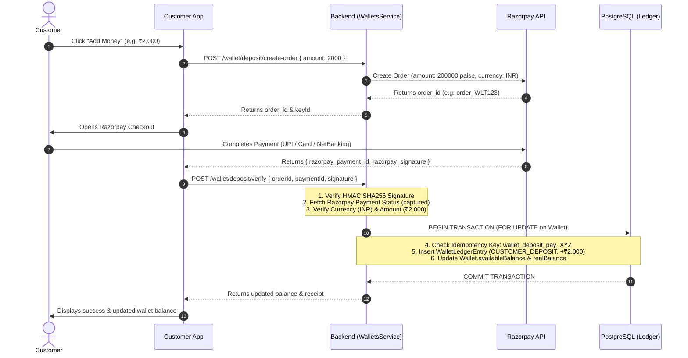
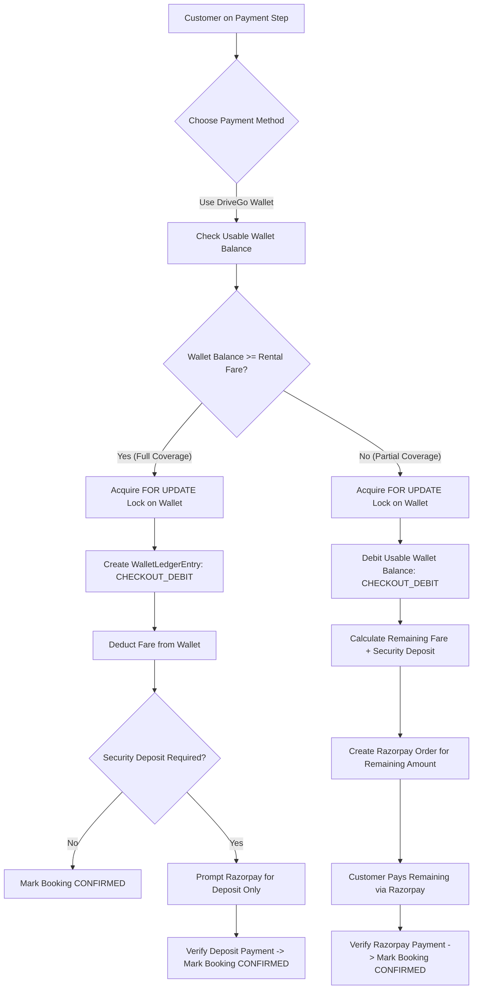

# DRIVEGO PHASE 7A FINAL DESIGN LOCK
**Scope:** Feature 24 (DriveGo Wallet Foundation) + Feature 23 (Referral Program) + Feature 25 (Loyalty Program)
**Status:** DESIGN LOCKED & READY FOR IMPLEMENTATION
**Audit Mode:** STRICT READ-ONLY (No Source Code or Database Mutations Executed)
**Benchmark Booking Safety:** `cmsu5sk3m000qgw1zaf9ftksz` (CONFIRMED / PAID / refundStatus: NONE — Verified Untouched)

---

## 1. Final Wallet Schema

```prisma
enum WalletStatus {
  ACTIVE
  FROZEN
  CLOSED
}

enum WalletBucketType {
  REAL_MONEY            // Withdrawable, usable for all fares & security deposits, no expiry
  PROMOTIONAL           // Non-withdrawable, usable for rental fares only, can expire
  REFUND_CREDIT         // Originating from booking cancellations/refunds
}

model Wallet {
  id               String               @id @default(cuid())
  userId           String               @unique
  user             User                 @relation(fields: [userId], references: [id], onDelete: Cascade)
  currency         String               @default("INR")
  availableBalance Decimal              @default(0) @db.Decimal(10, 2)
  lockedBalance    Decimal              @default(0) @db.Decimal(10, 2)
  realBalance      Decimal              @default(0) @db.Decimal(10, 2) // Cash deposits & withdrawable refunds
  promoBalance     Decimal              @default(0) @db.Decimal(10, 2) // Referral, loyalty, and promo credits
  status           WalletStatus         @default(ACTIVE)
  createdAt        DateTime             @default(now())
  updatedAt        DateTime             @updatedAt
  ledgerEntries    WalletLedgerEntry[]

  @@index([userId])
  @@index([status])
}
```

---

## 2. Final Ledger Schema

```prisma
enum LedgerEntryType {
  CUSTOMER_DEPOSIT      // User added real money via Razorpay PG
  CHECKOUT_DEBIT        // Used to pay for rental fare
  BOOKING_REFUND        // Refund for cancelled booking credited to wallet
  REFERRAL_REWARD       // Promotional credit earned by Referrer
  LOYALTY_CONVERSION    // Converted from loyalty points
  ADMIN_ADJUSTMENT      // Manual credit/debit with mandatory audit reason
  CANCELLATION_CREDIT   // Instant refund credit chosen by customer
  EXPIRATION            // Expired promotional credit debit
}

enum LedgerDirection {
  CREDIT
  DEBIT
}

model WalletLedgerEntry {
  id             String           @id @default(cuid())
  walletId       String
  wallet         Wallet           @relation(fields: [walletId], references: [id], onDelete: Cascade)
  type           LedgerEntryType
  direction      LedgerDirection
  bucket         WalletBucketType
  amount         Decimal          @db.Decimal(10, 2)
  balanceBefore  Decimal          @db.Decimal(10, 2)
  balanceAfter   Decimal          @db.Decimal(10, 2)
  referenceType  String           // "BOOKING", "PAYMENT", "REFERRAL", "LOYALTY", "ADMIN"
  referenceId    String?          // Entity CUID / Transaction ID
  idempotencyKey String           @unique
  description    String
  expiresAt      DateTime?        // Optional expiry date for promotional credits
  metadata       Json?            // Contextual audit details (e.g. breakdown, IP, admin notes)
  createdAt      DateTime         @default(now())

  @@index([walletId])
  @@index([referenceType, referenceId])
  @@index([bucket])
  @@index([createdAt])
}
```

---

## 3. Source & Bucket Strategy

| Source / Type | Bucket | Withdrawable | Usable for Fares | Usable for Security Deposit | Can Expire | Reversal Policy |
| :--- | :--- | :---: | :---: | :---: | :---: | :--- |
| `CUSTOMER_DEPOSIT` | `REAL_MONEY` | **YES** | **YES** | **YES** | **NO** | Refund back to original PG source |
| `BOOKING_REFUND` | `REFUND_CREDIT` | **YES** (if original was cash) | **YES** | **YES** | **NO** | Re-refund to source if disputed |
| `REFERRAL_REWARD` | `PROMOTIONAL` | **NO** | **YES** | **NO** | **YES** (180 days) | Void if referee booking is refunded |
| `LOYALTY_CONVERSION` | `PROMOTIONAL` | **NO** | **YES** | **NO** | **YES** (365 days) | Reversible via Admin adjudication |
| `CANCELLATION_CREDIT`| `REFUND_CREDIT` | **YES** | **YES** | **YES** | **NO** | Non-expiring store credit |
| `ADMIN_ADJUSTMENT` | `REAL_MONEY` / `PROMOTIONAL` | Per Admin Flag | **YES** | Per Flag | Per Flag | Offset by inverse ledger entry |

### Security Deposit Isolation Invariant
> **CRITICAL RULE:** Security deposits must remain completely separated from promotional wallet funds. Promotional wallet credits (`promoBalance`) **cannot** satisfy security deposit requirements. Only real money (`realBalance`, `CUSTOMER_DEPOSIT`, or direct Razorpay card/UPI pre-authorization) can be used to hold a security deposit.

---

## 4. Spending Priority (Deterministic Consumption Order)

When a customer uses their wallet to pay for a booking fare, the backend consumes funds in the following deterministic sequence:

1. **Expiring Promotional Credits:** Promotional credits with an `expiresAt` timestamp (oldest/soonest expiry consumed first).
2. **Referral / Promotional Credits:** Standard promotional credits without immediate expiry (`promoBalance`).
3. **Loyalty Converted Credits:** Converted points credit (`promoBalance`).
4. **Booking Refund Credits:** Store credits originating from previous booking cancellations (`realBalance`).
5. **Customer Cash Deposits:** Real money deposited via payment gateway (`realBalance`).

*Benefit:* The customer automatically burns short-lived, restricted promotional balance first, preserving their real cash balance.

---

## 5. Wallet Deposit & Payment Gateway Flow



### Safety Guarantees:
- **Zero Double-Credit:** Duplicate verification calls return the original transaction idempotently.
- **Verification Gate:** No wallet credit occurs without verified signature and captured Razorpay status.
- **Reconciliation Catch:** If the network fails between Razorpay capture and client verification, `FinancialReconciliationService` fetches uncredited orders from Razorpay and completes the ledger entry atomically.

---

## 6. Wallet Checkout Flow



---

## 7. Refund Flow

1. **Full Cancellation / Refund Policy:**
   - If fare was paid **100% via Wallet**: Refund amount is credited back to Wallet ledger (`type: BOOKING_REFUND`) with idempotency key `wallet_refund_${bookingId}_${paymentId}`.
   - If fare was paid **partially via Wallet and partially via Razorpay**:
     - Wallet portion is refunded back to Wallet ledger (`type: BOOKING_REFUND`).
     - Razorpay portion is refunded to original source bank account via Razorpay Refund API (or optionally credited to Wallet as `CANCELLATION_CREDIT` if customer selects instant wallet refund).
2. **Security Deposit Refund:**
   - Security deposits held via Razorpay are released directly back to the original source card/UPI.
   - Security deposits held via real cash wallet balance are released back to `Wallet.realBalance`.

---

## 8. Reconciliation Strategy

1. **Continuous Ledger Integrity Invariant:**
   $$\text{Wallet.availableBalance} \equiv \sum \text{Ledger CREDITS} - \sum \text{Ledger DEBITS}$$
   $$\text{Wallet.realBalance} + \text{Wallet.promoBalance} \equiv \text{Wallet.availableBalance}$$
2. **Automated Audit Job (`FinancialReconciliationService`):**
   - Scheduled cron job runs every 15 minutes.
   - Executes database query comparing cached balances against ledger aggregates:
     ```sql
     SELECT
       w.id,
       w."userId",
       w."availableBalance" AS cached_balance,
       COALESCE(SUM(CASE WHEN e.direction = 'CREDIT' THEN e.amount ELSE -e.amount END), 0) AS computed_balance
     FROM "Wallet" w
     LEFT JOIN "WalletLedgerEntry" e ON e."walletId" = w.id
     GROUP BY w.id, w."userId", w."availableBalance"
     HAVING w."availableBalance" <> COALESCE(SUM(CASE WHEN e.direction = 'CREDIT' THEN e.amount ELSE -e.amount END), 0);
     ```
   - **Discrepancy Action:** If any mismatch is found, the system immediately flags the wallet as `FROZEN`, emits a high-severity `ApmMonitoringService` alert, and logs an entry in `AuditLog`.

---

## 9. Exact Deterministic Idempotency Keys

| Business Event | Idempotency Key Pattern |
| :--- | :--- |
| **Wallet Deposit (PG)** | `wallet_deposit_${razorpayPaymentId}` |
| **Booking Checkout (Wallet Debit)** | `wallet_checkout_${bookingId}` |
| **Booking Extension (Wallet Debit)** | `wallet_extension_${extensionId}` |
| **Booking Cancellation Refund** | `wallet_refund_${bookingId}_${paymentId}` |
| **Referral Reward (Referrer Credit)** | `ref_reward_${attributionId}_referrer` |
| **Referral Reward (Referee Bonus)** | `ref_reward_${attributionId}_referee` |
| **Loyalty Redemption to Wallet** | `loyalty_conversion_${loyaltyTransactionId}` |
| **Admin Manual Adjustment** | `wallet_admin_adj_${adminUserId}_${targetWalletId}_${clientNonce}` |
| **Promotional Credit Expiration** | `wallet_expire_${ledgerEntryId}` |

---

## 10. Loyalty Points Calculation Formula & Rounding Behavior

### Business Rules
- **Base Rate:** 1 Point per ₹10 of eligible rental base fare (`eligibleBaseFare`).
- **Eligible Amount:** Base trip fare minus coupon discounts (excluding GST, security deposits, delivery fees, and insurance fees).
- **Multipliers:**
  - **Bronze:** 1.00x
  - **Silver:** 1.25x
  - **Gold:** 1.50x
  - **Platinum:** 2.00x

### Exact Mathematical Formula
$$\text{basePoints} = \lfloor \frac{\text{eligibleBaseFare}}{10} \rfloor$$
$$\text{finalPoints} = \lfloor \text{basePoints} \times \text{tierMultiplier} \rfloor$$

*Rounding Behavior:* Integer truncation floor ($\lfloor \dots \rfloor$) is applied at both steps. Fractional points are never awarded.

### Examples:
- **Example A:** ₹2,450 base fare on Silver Tier (1.25x):
  - $\text{basePoints} = \lfloor 2450 / 10 \rfloor = 245$
  - $\text{finalPoints} = \lfloor 245 \times 1.25 \rfloor = \lfloor 306.25 \rfloor = \mathbf{306\text{ points}}$.
- **Example B:** ₹999 base fare on Gold Tier (1.50x):
  - $\text{basePoints} = \lfloor 999 / 10 \rfloor = 99$
  - $\text{finalPoints} = \lfloor 99 \times 1.50 \rfloor = \lfloor 148.50 \rfloor = \mathbf{148\text{ points}}$.

---

## 11. Referral Reward Timing & Model

1. **Referrer Reward:**
   - **Benefit:** ₹250 DriveGo Wallet promotional credit (`bucket: PROMOTIONAL`, `type: REFERRAL_REWARD`).
   - **Trigger:** Credited **only after** the referee's first qualifying booking reaches `COMPLETED` status.
   - **Exclusions:** Cancelled, refunded, or disputed bookings void the referral reward.
2. **Referee Reward:**
   - **Benefit:** ₹250 first-booking promotional discount (applied as an upfront coupon during checkout for bookings $\ge ₹1,000$).
   - **No Double Dipping:** Referee does **not** receive wallet cash post-trip; their reward is realized at checkout.
3. **Idempotency & Replay Protection:**
   - `ReferralAttribution` records `status = REWARDED`, `referrerLedgerEntryId`, and `rewardedAt`.
   - Repeated webhook triggers or status events cannot re-issue rewards.

---

## 12. Loyalty Tier Configuration Strategy

Tiers are fully dynamic and configurable via the `LoyaltyTier` database model:

```prisma
enum LoyaltyTierCode {
  BRONZE
  SILVER
  GOLD
  PLATINUM
}

model LoyaltyTier {
  id                    String          @id @default(cuid())
  code                  LoyaltyTierCode @unique
  name                  String
  minPointsRequired     Int             @default(0)
  pointsMultiplier      Decimal         @default(1.00) @db.Decimal(3, 2)
  cashbackPercent       Decimal         @default(1.00) @db.Decimal(5, 2)
  prioritySupport       Boolean         @default(false)
  freeCancellationCount Int             @default(0)
  createdAt             DateTime        @default(now())
  updatedAt             DateTime        @updatedAt
  accounts              LoyaltyAccount[]
}
```

### Proposed Baseline Configuration:
- **Bronze:** 0 – 999 lifetime points (1.00x multiplier)
- **Silver:** 1,000 – 4,999 lifetime points (1.25x multiplier)
- **Gold:** 5,000 – 14,999 lifetime points (1.50x multiplier)
- **Platinum:** 15,000+ lifetime points (2.00x multiplier)
- **Points to Cash Conversion Rate:** 2 Points = ₹1.00 Wallet Credit (500 pts = ₹250).

---

## 13. Security Controls & RBAC

1. **IDOR Protection:**
   - Users can only query their own wallet (`req.user.id === wallet.userId`).
   - Access to other wallets returns `403 Forbidden`.
2. **Admin Role Isolation:**
   - Only users with `role: ADMIN` can execute manual adjustments (`POST /wallet/admin/adjust`) or configure tiers.
   - Every admin adjustment requires a mandatory `reason` string and writes an immutable audit record to `AuditLog`.
3. **Fraud Velocity Limits:**
   - Maximum 20 rewarded referrals per referrer per campaign.
   - Maximum wallet deposit limit per single transaction (e.g. ₹50,000).
   - Maximum wallet balance limit (e.g. ₹1,00,000).

---

## 14. Concurrency Strategy

1. **Pessimistic Row-Level Lock:**
   Every balance credit/debit executes inside an atomic `prisma.$transaction`:
   ```sql
   SELECT id, "availableBalance", "lockedBalance", status FROM "Wallet" WHERE id = $1 FOR UPDATE;
   ```
2. **Atomic Invariant Check:**
   - If `status !== ACTIVE`, throw `WalletFrozenException`.
   - If debit and `availableBalance < amount`, throw `InsufficientBalanceException`.
   - Calculate `balanceAfter = balanceBefore ± amount`.
   - Insert `WalletLedgerEntry` and update `Wallet` in the same transaction.

---

## 15. Migration Safety Plan

- **Additive Migration:** New models (`Wallet`, `WalletLedgerEntry`, `ReferralCampaign`, `ReferralAttribution`, `LoyaltyTier`, `LoyaltyAccount`, `LoyaltyTransaction`) and optional relation `User.wallet`, `User.loyaltyAccount`, `User.referralCode`.
- **Zero Data Loss:** Existing tables (`Booking`, `Payment`, `Invoice`, `SecurityDeposit`) remain untouched.
- **Rollback Safety:** The migration can be completely rolled back via SQL down scripts without affecting core booking or payment operations.

---

## 16. Comprehensive Test Plan

1. **Backend Unit & Concurrency Tests (`wallet-ledger.spec.ts`):**
   - Test wallet auto-creation for users.
   - Test deposits, checkouts, refunds, and promo credits.
   - Test insufficient balance rejection.
   - Test concurrent debits with race condition simulation.
   - Test duplicate idempotency key deduplication.
2. **Referral Test Suite (`referral-program.spec.ts`):**
   - Test code attribution on signup.
   - Test self-referral rejection.
   - Test reward dispatch upon booking `COMPLETED`.
   - Test reward cancellation upon trip cancellation.
3. **Loyalty Test Suite (`loyalty-program.spec.ts`):**
   - Test point calculation formula with floor truncation.
   - Test tier progression (Bronze $\rightarrow$ Silver $\rightarrow$ Gold).
   - Test redemption of points to wallet credit.
4. **Benchmark Database Safety:**
   - Execute `node scratch/check_db_safety.js`.
   - Verify `cmsu5sk3m000qgw1zaf9ftksz` remains `CONFIRMED / PAID / NONE`.

---

## 17. Product Decisions Locked

1. **Loyalty Point Formula:** $\text{finalPoints} = \lfloor \lfloor \frac{\text{eligibleBaseFare}}{10} \rfloor \times \text{tierMultiplier} \rfloor$ (Locked).
2. **Referrer Reward:** ₹250 Wallet promotional credit upon referee trip completion (Locked).
3. **Referee Reward:** ₹250 first-trip checkout discount for bookings $\ge ₹1,000$ (Locked).
4. **Security Deposit Isolation:** Promotional credits **cannot** pay for security deposits (Locked).
5. **Spending Priority:** Expiring Promo $\rightarrow$ Referral Promo $\rightarrow$ Loyalty Promo $\rightarrow$ Refund Credit $\rightarrow$ Real Cash (Locked).

---

## PHASE 7A DESIGN VERDICT
**READY TO IMPLEMENT**

### Immediate Implementation Sequence (Phase 7A):
1. Create formal database migration: `20260816200000_add_wallet_referral_loyalty`.
2. Generate Prisma Client (`npx prisma generate`).
3. Implement `WalletsModule` (`WalletsService`, `WalletsController`, DTOs, pessimistic concurrency locks).
4. Implement `wallet-ledger.spec.ts` unit test suite.
5. Validate with `npm test`, `npm run build`, and `node scratch/check_db_safety.js`.
