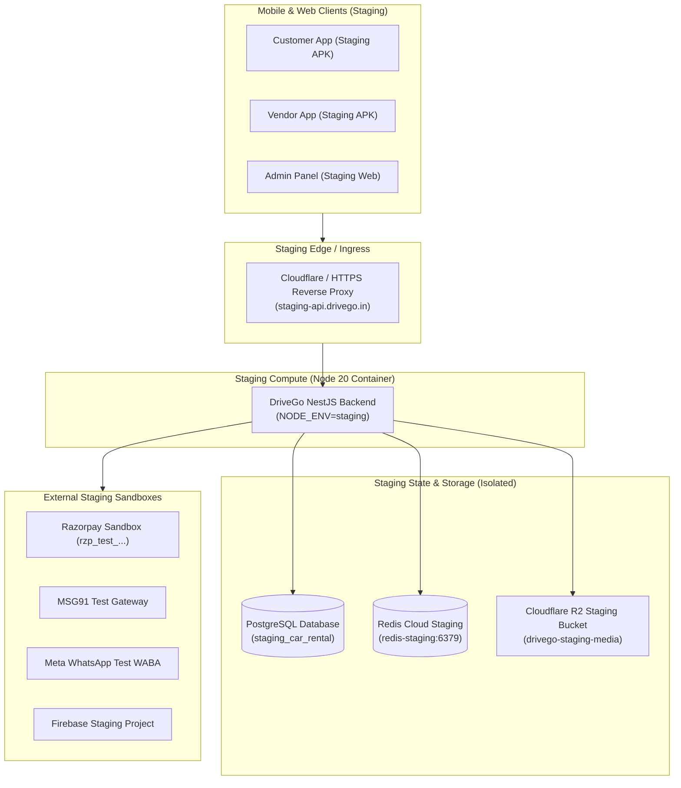

# DriveGo — Staging Deployment & Infrastructure Plan

**Version:** 1.0.0  
**Target Environment:** Staging / Pre-Production  
**Objective:** Provide an isolated, reproducible pre-production environment for executing end-to-end integration tests with external sandbox APIs (Razorpay Sandbox, MSG91 DLT Staging, Meta WhatsApp Test Account, Firebase Staging, Managed Redis Staging).

---

## 1. Staging Infrastructure Architecture



---

## 2. Infrastructure Component Specifications

### A. Compute / Container Environment
- **Platform:** Docker container / AWS ECS / Render / Fly.io / GCP Cloud Run.
- **Node.js Runtime:** Node.js 20 LTS (Alpine Linux).
- **Environment:** `NODE_ENV="staging"`, `PORT=3000`.
- **Scaling:** 1 instance (0.5 vCPU, 512MB RAM minimum).

### B. Isolated Staging Database (PostgreSQL)
- **Database Name:** `drivego_staging` (Must be completely separate from production database).
- **Connection URL:** `postgresql://staging_user:<PASS>@<STAGING_HOST>:5432/drivego_staging?schema=public`.
- **Migration Deployment:** Automated execution of `npx prisma migrate deploy` on container startup.
- **Safety Policy:** Benchmark production booking ID `cmsu5sk3m000qgw1zaf9ftksz` exists exclusively on the production database and must never be copied to or mutated by staging tests.

### C. Staging Redis Instance
- **Platform:** Upstash Redis / Redis Cloud / AWS ElastiCache Free Tier.
- **Connection URL:** `rediss://default:<PASS>@<STAGING_REDIS_HOST>:6379`.
- **Use Case:** Distributed car reservation locks, cancellation locks, OTP rate limits.

### D. Staging Media Bucket (Object Storage)
- **Platform:** Cloudflare R2 / AWS S3.
- **Bucket Name:** `drivego-staging-media`.
- **Public URL:** `https://staging-media.drivego.in`.

---

## 3. Staging Environment Variables Configuration

```env
# Node Environment
NODE_ENV="staging"
PORT=3000

# Isolated Database & Cache
DATABASE_URL="postgresql://staging_user:<STAGING_PASSWORD>@<STAGING_HOST>:5432/drivego_staging?schema=public"
REDIS_URL="rediss://default:<STAGING_REDIS_PASSWORD>@<STAGING_REDIS_HOST>:6379"

# Security & CORS
CORS_ALLOWED_ORIGINS="https://staging-admin.drivego.in,http://localhost:8080"
JWT_ACCESS_SECRET="staging_jwt_access_secret_64_characters_min_abcdef1234567890"
JWT_REFRESH_SECRET="staging_jwt_refresh_secret_64_characters_min_abcdef1234567890"
JWT_ACCESS_EXPIRY="15m"
JWT_REFRESH_EXPIRY="30d"
BANK_ENCRYPTION_KEY="staging_bank_enc_key_32_bytes_hex_1234567890abcdef1234567890abcdef"

# External Sandboxes
SMS_PROVIDER="mock" # Set to msg91 when testing live SMS
MSG91_AUTH_KEY="<STAGING_MSG91_AUTH_KEY>"
MSG91_SENDER_ID="DRIVGO"
MSG91_TEMPLATE_ID="<STAGING_MSG91_TEMPLATE_ID>"

RAZORPAY_USE_MOCK="false" # Enable real Razorpay Test API calls
RAZORPAY_KEY_ID="rzp_test_<STAGING_KEY_ID>"
RAZORPAY_KEY_SECRET="<STAGING_KEY_SECRET>"
RAZORPAY_WEBHOOK_SECRET="<STAGING_WEBHOOK_SECRET>"

WHATSAPP_ACCESS_TOKEN="<STAGING_META_WABA_TOKEN>"
WHATSAPP_PHONE_NUMBER_ID="<STAGING_PHONE_NUMBER_ID>"
WHATSAPP_APP_SECRET="<STAGING_APP_SECRET>"
WHATSAPP_WEBHOOK_VERIFY_TOKEN="<STAGING_VERIFY_TOKEN>"
WHATSAPP_API_VERSION="v20.0"

FIREBASE_PROJECT_ID="drivego-staging"
FIREBASE_CLIENT_EMAIL="firebase-adminsdk@drivego-staging.iam.gserviceaccount.com"
FIREBASE_PRIVATE_KEY="<STAGING_FIREBASE_PRIVATE_KEY>"

SENTRY_DSN=""
```

---

## 4. Step-by-Step Staging Deployment Workflow

1. **Step 1: Provision Isolated Database & Cache**
   - Create PostgreSQL instance `drivego_staging`.
   - Create Redis staging instance.
2. **Step 2: Apply Migrations**
   ```bash
   DATABASE_URL="<STAGING_DATABASE_URL>" npx prisma migrate deploy
   ```
3. **Step 3: Deploy Backend Container**
   ```bash
   docker build -t drivego-backend:staging ./car_rental_backend
   docker run -d --name drivego-staging-api -p 3000:3000 --env-file .env.staging drivego-backend:staging
   ```
4. **Step 4: Register Razorpay Test Webhooks**
   - URL: `https://staging-api.drivego.in/payments/webhook`
   - Secret: `RAZORPAY_WEBHOOK_SECRET`
   - Events: `payment.captured`, `payment.failed`, `refund.processed`, `refund.failed`
5. **Step 5: Register Meta WhatsApp Test Webhooks**
   - URL: `https://staging-api.drivego.in/whatsapp/webhook`
   - Verify Token: `WHATSAPP_WEBHOOK_VERIFY_TOKEN`
   - Event Subscriptions: `messages`
6. **Step 6: Build Staging Mobile & Web Clients**
   ```bash
   # Customer App Staging Build
   cd apps/customer_app
   flutter build apk --dart-define=API_BASE_URL=https://staging-api.drivego.in

   # Vendor App Staging Build
   cd ../vendor_app
   flutter build apk --dart-define=API_BASE_URL=https://staging-api.drivego.in

   # Admin Panel Web Staging Build
   cd ../admin_panel
   flutter build web --dart-define=API_BASE_URL=https://staging-api.drivego.in
   ```

---

## 5. Controlled Staging E2E Test Suite Matrix

| # | Test Case | Target Service | Expected Result |
| :---: | :--- | :--- | :--- |
| **1** | Customer Auth with OTP | `AuthService` + SMS Sandbox | User created $\rightarrow$ OTP verified $\rightarrow$ JWT issued |
| **2** | Razorpay Sandbox Payment | `PaymentsService` + Razorpay Test | Order created $\rightarrow$ Mock payment verified $\rightarrow$ Booking `CONFIRMED` |
| **3** | Webhook Idempotency | `PaymentsService` | Duplicate `payment.captured` event processed with 0 duplicate ledger mutations |
| **4** | Concurrent Booking Collision | `BookingLockService` + Staging Redis | User A succeeds; User B receives HTTP 409 Conflict |
| **5** | Fraud Checkout Block | `FraudService` + `BookingsService` | Critical risk score $\ge 80$ blocks booking with HTTP 403 Forbidden |
| **6** | Vendor Inspection & Handover | `VendorApp` + Backend API | Pre-trip photo uploaded $\rightarrow$ Handover OTP verified $\rightarrow$ `ONGOING` |
| **7** | Vehicle Return & Refund | `BookingsService` + Razorpay Refund | Post-trip OTP verified $\rightarrow$ Deposit released $\rightarrow$ Refund idempotency check |
