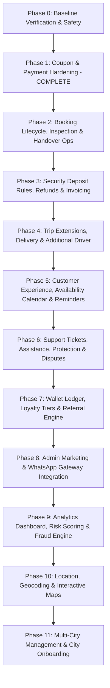

# DRIVEGO MASTER PRODUCT ROADMAP AUDIT & ARCHITECTURE SPECIFICATION
**Version:** 1.0.0  
**Date:** August 16, 2026  
**Coverage:** All 35 Product Features + Multi-City Expansion (36 Features Total)  

---

## Executive Summary

DriveGo is a multi-tenant, multi-city car-rental platform built with a NestJS backend (PostgreSQL + Prisma, Redis, Razorpay), Flutter Customer App, Vendor Portal, and Admin Panel. 

This audit evaluates the codebase against the locked 36-feature master product roadmap to establish exact implementation status (**COMPLETE**, **PARTIAL**, **MISSING**, **NEEDS HARDENING**), eliminate architectural duplication, enforce financial integrity, and establish a dependency-safe multi-phase execution plan.

---

## Benchmark Database Safety & Baseline Integrity

* **Benchmark Booking ID:** `cmsu5sk3m000qgw1zaf9ftksz`
* **Status:** `CONFIRMED`
* **Payment Status:** `PAID`
* **Refund Status:** `NONE`
* **Razorpay Order ID:** `order_TPzl7SXwjr5HV7`
* **Razorpay Payment ID:** `pay_TQ2F0i7NrsLqmu`
* **Active Trip Types:** `SELF_DRIVE` (ACTIVE), `OUTSTATION` (ACTIVE)
* **Disabled Trip Types:** `LOCAL` (COMING SOON), `AIRPORT_TRANSFER` (COMING SOON)
* **Rule:** The benchmark booking is 100% untouched and preserved.

---

## Feature Audit & Classification Matrix (1 – 36)

### 1. Apply Coupon
* **Classification:** `COMPLETE (HARDENED)`
* **Backend:** `CouponsService` in `car_rental_backend/src/coupons/`
* **Database:** `Coupon` and `CouponUsage` models with `@unique([bookingId])`
* **Customer App:** `FareBreakdownStep` promo code input, validation provider, discount line item
* **Security & Concurrency:** Backend-authoritative calculation (`totalFare = max(0, subtotal - discountAmount)`). Deferred usage timing (consumed only inside `POST /payments/verify` transaction when payment moves to `PAID`). Pessimistic row locking via PostgreSQL `SELECT FOR UPDATE` on `Coupon` row inside transaction.
* **Financials:** Razorpay payment order amount equals `totalFare * 100` in paise.
* **Tests:** 15 unit tests in `coupons.spec.ts`, integration tests in `payments-verification.spec.ts`.

### 2. Coupon Admin Management
* **Classification:** `COMPLETE`
* **Backend:** `CouponsController` (`/admin/coupons` endpoints for create, update, list, deactivate).
* **Database:** `Coupon` model supporting 14 validation rules: `code`, `discountType`, `discountValue`, `maxDiscountAmount`, `minBookingAmount`, `startDate`, `expiresAt`, `isActive`, `globalUsageLimit`, `perCustomerLimit`, `firstBookingOnly`, `city`, `tripType`, `carCategory`.
* **Admin Panel:** `AdminCouponsPage` for managing promotional codes.
* **Tests:** 15 unit tests in `coupons.spec.ts`.

### 3. Coupon Server-Side Calculation
* **Classification:** `COMPLETE`
* **Backend:** Client sends `couponCode` only. Server evaluates all 14 eligibility rules authoritatively. Total fare calculated in NestJS and persisted to PostgreSQL `Booking` table.
* **Security:** Client cannot tamper with `discountAmount` or `totalFare`.
* **Tests:** Verified in `coupons.spec.ts` and `payments.service.ts`.

### 4. Security Deposit Configuration
* **Classification:** `PARTIAL`
* **Current State:** `SecurityDeposit` model exists with statuses `REQUIRED`, `HELD`, `REFUNDED`, `PARTIALLY_REFUNDED`, `FORFEITED`, `CANCELLED`. Integrated as a non-fare deposit line item in `POST /payments/create-order` and `POST /payments/verify`. Held deposits are tracked separately from rental fare revenue. `DamageClaim` model exists for vendor damage claims.
* **Gaps:** Need city/car-category deposit configuration rules engine in admin panel.

### 5. Customer KYC / Driving Licence Verification
* **Classification:** `PARTIAL`
* **Current State:** `Document` model exists for Vendor verification (`RC_BOOK`, `TRADE_LICENSE`, `INSURANCE`). Customer driving licence upload is currently handled via basic string fields.
* **Gaps:** Extend document model or add `KycDocument` model with statuses `PENDING`, `VERIFIED`, `REJECTED`, `EXPIRED`. Create Customer KYC upload UI and Admin KYC review/adjudication dashboard.

### 6. Pre-Trip Vehicle Inspection
* **Classification:** `COMPLETE`
* **Backend:** `InspectionsService` supporting `PRE_TRIP` inspection, photos array, odometer decimal, fuel percent, condition notes, and finalized timestamp (`Inspection` model with `@unique([bookingId, type])`).
* **Tests:** Verified in `handover-inspection.spec.ts`.

### 7. Vehicle Handover
* **Classification:** `COMPLETE`
* **Backend:** `HandoverOtpService` supporting `PICKUP` OTP generation (6-digit crypto hash), 3-attempt lock, expiry validation, and transition of booking to `ONGOING`.
* **Tests:** Verified in `handover-inspection.spec.ts`.

### 8. Vehicle Return
* **Classification:** `COMPLETE`
* **Backend:** `RETURN` OTP type, post-trip inspection recording (`InspectionType.POST_TRIP`), odometer & fuel variance calculation, booking completion.
* **Tests:** Verified in `handover-inspection.spec.ts`.

### 9. Booking Lifecycle Beyond Confirmed
* **Classification:** `PARTIAL`
* **Current State:** `BookingStatus` enum contains `PENDING`, `CONFIRMED`, `ONGOING`, `COMPLETED`, `CANCELLED`.
* **Gaps:** Add granular status transitions (`HANDOVER_READY`, `RETURN_PENDING`, `REFUND_PENDING`) in backend state machine with strict server-side transition guards.

### 10. Trip Extension
* **Classification:** `MISSING`
* **Gaps:** Implement extension request endpoint `POST /bookings/:id/extend`, check date availability against car `blockedDates` and overlapping bookings, compute additional fare & platform fee, create Razorpay payment order for extension, and update `endDate` upon payment verification.

### 11. Customer Cancellation / Refund UX
* **Classification:** `COMPLETE`
* **Backend:** `CancellationPolicyService` evaluating hours prior to pickup, tier calculation (100% refund, 75% refund, non-refundable), idempotent Razorpay refund execution (`POST /payments/refund`).
* **Customer App:** `CancellationPreviewPage` UI displaying breakdown and refund estimate.
* **Tests:** Verified in `cancellation-policy.spec.ts` and `refunds.spec.ts`.

### 12. Vendor Booking Operations
* **Classification:** `PARTIAL`
* **Backend:** Vendor booking query endpoints (`GET /bookings/vendor`).
* **Vendor Portal:** Needs dedicated operational tabs for Handover OTP entry, Return inspection submission, and active rental status tracking.

### 13. Vendor Earnings / Payouts
* **Classification:** `COMPLETE`
* **Backend:** `PayoutsService`, `Payout` model, platform commission calculation, GST deductions, encrypted bank details at rest using AES-256-GCM encryption (`BankEncryptionService`).
* **Tests:** Verified in `payouts-integrity.spec.ts`, `bank-encryption.spec.ts`, `backfill-bank-encryption.spec.ts`.

### 14. Invoice / Receipt
* **Classification:** `MISSING`
* **Gaps:** Implement PDF generation service (`pdfkit` / `puppeteer`) for booking invoice, payment receipt, and refund receipt. Expose `GET /bookings/:id/invoice.pdf`.

### 15. Customer Support
* **Classification:** `PARTIAL`
* **Current State:** `PlatformSettings.supportEmail` / `supportPhone`, `Role.SUPPORT_AGENT` enum.
* **Gaps:** `SupportTicket` & `SupportMessage` models, ticket creation in app, agent conversation portal in Admin Panel.

### 16. Roadside / Emergency Assistance
* **Classification:** `MISSING`
* **Gaps:** Booking-linked emergency request endpoint (`POST /assistance/request`), assistance types (`BREAKDOWN`, `ACCIDENT`, `TYRE`, `BATTERY`, `TOWING`), location sharing, admin dispatch dashboard.

### 17. Insurance / Protection Presentation
* **Classification:** `MISSING`
* **Gaps:** Configurable protection plans (Basic, Premium), coverage terms, excess deductible presentation, add-on price integration into backend fare calculator.

### 18. Notifications / Reminders
* **Classification:** `PARTIAL`
* **Backend:** `NotificationsService`, `Notification` model, in-app notification list, FCM token storage.
* **Gaps:** Cron-based scheduled reminders (trip starting in 2h, return due in 1h).

### 19. Reviews / Ratings
* **Classification:** `COMPLETE`
* **Backend:** `ReviewsService`, `Review` model (`@unique([bookingId])`), rating 1-5, comment, vendor rating aggregation.
* **Customer App:** Review submission screen post-completion.

### 20. Availability Calendar
* **Classification:** `PARTIAL`
* **Backend:** `Car.blockedDates`, overlapping booking checks in pessimistic lock.
* **Gaps:** Month-view availability calendar endpoint `GET /cars/:id/availability-calendar`.

### 21. Favorites
* **Classification:** `COMPLETE`
* **Backend:** `Wishlist` model (`@unique([userId, carId])`), `WishlistService`.
* **Customer App:** Favorites tab and heart toggle.

### 22. Recently Viewed
* **Classification:** `COMPLETE`
* **Backend:** `RecentlyViewed` model, `RecentlyViewedService` (capped history per user).
* **Customer App:** Recently viewed horizontal list.

### 23. Referral Program
* **Classification:** `MISSING`
* **Gaps:** Unique referral code on `User`, referral tracking model, credit award after referred user's first completed paid trip.

### 24. DriveGo Wallet
* **Classification:** `MISSING`
* **Gaps:** `Wallet` & `WalletTransaction` models, double-entry ledger (credits, debits), applying wallet balance at checkout.

### 25. Loyalty
* **Classification:** `MISSING`
* **Gaps:** Loyalty points model, points earning rules per ₹ spent, tier management (Bronze, Silver, Gold), points redemption at checkout.

### 26. Delivery / Pickup
* **Classification:** `MISSING`
* **Gaps:** Self-pickup vs Home Delivery option, delivery fee calculation based on distance/radius, delivery address validation.

### 27. Advanced Search / Filtering
* **Classification:** `COMPLETE`
* **Backend:** Filtering by city, tripType, dates, carCategory, price range, transmission, fuelType, sorting.
* **Customer App:** Comprehensive search filter bottom sheet.
* **Tests:** Verified in `cars-verified-filter.spec.ts`.

### 28. Better Car Details
* **Classification:** `COMPLETE`
* **Customer App:** Image carousel, specs grid, vendor info, cancellation policy preview, fare breakdown.

### 29. Additional Driver
* **Classification:** `MISSING`
* **Gaps:** `AdditionalDriver` model, DL upload, verification status, fixed add-on fee per additional driver.

### 30. WhatsApp Integration
* **Classification:** `MISSING`
* **Gaps:** WhatsApp provider abstraction (Twilio / Meta Cloud API), notification dispatch triggers for booking confirmation & OTPs.

### 31. Admin Marketing
* **Classification:** `PARTIAL`
* **Backend:** `BannersService`, `Banner` model, `CouponsModule`.
* **Gaps:** Push notification campaign sender in Admin Panel.

### 32. Analytics
* **Classification:** `PARTIAL`
* **Backend:** `GET /admin/dashboard` (GMV, platform revenue, total bookings).
* **Gaps:** Vendor utilization charts, CSV export endpoints for revenue/bookings.

### 33. Disputes
* **Classification:** `COMPLETE`
* **Backend:** `Dispute` & `DisputeEvidence` models, `DisputesService` (raise dispute, upload evidence, admin resolution).
* **Admin Panel:** `AdminDisputesPage`.

### 34. Fraud Detection
* **Classification:** `MISSING`
* **Gaps:** Fraud risk scoring service (failed payment velocity, coupon abuse, multiple accounts, KYC mismatch), admin risk flag review UI.

### 35. Location / Maps
* **Classification:** `PARTIAL`
* **Backend:** Vendor lat/long, city coordinates, distance calculations.
* **Gaps:** Flutter interactive map view integration for pickup locations.

### 36. Multi-City Expansion
* **Classification:** `COMPLETE (HARDENED)`
* **Backend:** `SupportedCity` model with `enabledTripTypes`, city inventory isolation, fallback to `PlatformSettings`.
* **Rules:** `SELF_DRIVE` = ACTIVE, `OUTSTATION` = ACTIVE, `LOCAL` = COMING SOON, `AIRPORT_TRANSFER` = COMING SOON.
* **Tests:** Verified in `multi-city-hardening.spec.ts`.

---

## Phased Master Implementation Roadmap

---

## Recommendations & Next Steps

1. Maintain `cmsu5sk3m000qgw1zaf9ftksz` benchmark booking untouched.
2. Proceed with **Phase 2 Implementation** (Booking Lifecycle State Machine, Pre/Post Trip Inspections UI, Handover & Return OTP operational flows, Availability Calendar).
