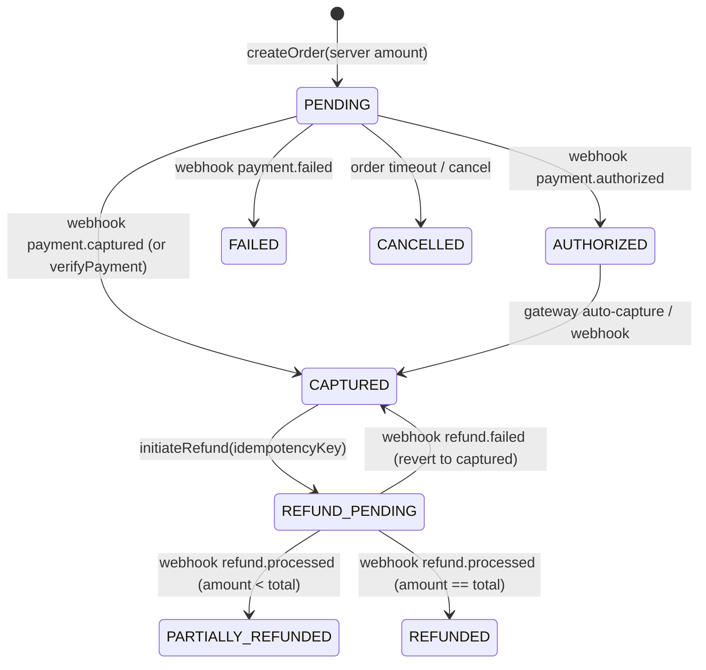
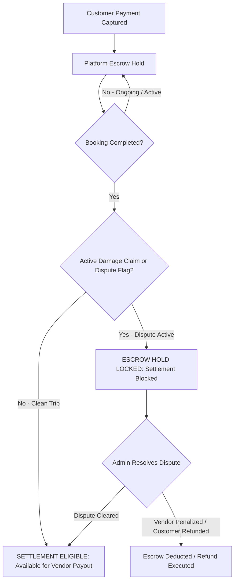

# Phase 30: Authoritative Payment State Machine & Lifecycle Architecture

## 1. Overview & Architectural Principle

In DriveGo Phase 30, the payment domain is strictly isolated from the booking domain. The backend acts as the sole source of truth for all financial transitions.

```
       Customer App (Initiates Intent)
                     ↓
     DriveGo Backend (/payments/create-order)
                     ↓
           Razorpay / Gateway API
                     ↓
         Client-Side Checkout Sheet
                     ↓
       Gateway Webhook Engine (HMAC-SHA256)
                     ↓
DriveGo Hardened Ingestion (/payments/webhook)
                     ↓
[Unique Constraint Deduplication on WebhookEvent]
                     ↓
Authoritative Payment & Refund State Machine Transition
                     ↓
   Atomic Booking Sync & Escrow Settlement Eligibility
```

---

## 2. Decoupled State Machines: Payment vs. Booking

Under no circumstance does `Booking.status` substitute for `Payment.status`. The two lifecycles operate as distinct but synchronized state machines.

### 2.1 Authoritative Payment Status Model (`PaymentStatus`)

| State | Gateway Equivalent | Description |
| :--- | :--- | :--- |
| `PENDING` / `CREATED` | Order created | Payment order created on gateway. Client has received order ID and amount in paise. No charge yet. |
| `AUTHORIZED` | Payment authorized | Payment authorized by issuer/gateway, pre-capture hold. |
| `CAPTURED` / `PAID` | Payment captured | Funds successfully settled to platform merchant account. Authorized and captured. |
| `FAILED` | Payment failed | Payment gateway declined, insufficient funds, card expired, or fraud trigger. |
| `CANCELLED` | Order expired | Payment order expired or cancelled without capture. |
| `REFUND_PENDING` | Refund initiated | Refund request accepted by gateway, pending batch/settlement processing. |
| `REFUNDED` | Full refund processed | 100% of captured payment amount successfully refunded to source instrument. |
| `PARTIALLY_REFUNDED` | Partial refund processed | Part of payment refunded (e.g. late cancellation fee deduction, damage hold balance). |

---

### 2.2 Payment Refund Status Model (`RefundStatus`)

Individual refund operations are tracked in the `PaymentRefund` ledger:

| Refund State | Description |
| :--- | :--- |
| `REQUESTED` | Refund requested by customer cancellation policy or admin override. |
| `PENDING` | Sent to gateway with idempotency key, awaiting gateway asynchronous confirmation. |
| `PROCESSED` | Gateway webhook or polling confirmed successful refund transfer to customer. |
| `FAILED` | Gateway rejected refund (e.g. gateway balance insufficient, account blocked). |

---

## 3. Transition Invariant Matrix



### Transition Guarantees:
1. **No Client-Direct Success**: The client callback `/payments/verify` verifies gateway HMAC-SHA256 signature server-side and checks `expectedAmount == receivedAmount`. Even if the client never calls back (e.g. app killed, network lost), gateway webhooks asynchronously reconcile the state to `CAPTURED`.
2. **Strict Monotonic Capture**: A payment in `CAPTURED` cannot revert to `PENDING` or `FAILED`.
3. **Idempotent Webhook Replay**: Duplicate webhooks with identical event IDs (`WebhookEvent.eventId`) are recorded via database unique constraint (`@@unique([provider, eventId])`). Second arrivals immediately return HTTP 200 `{ status: 'ignored', reason: 'duplicate' }` without re-executing booking updates, customer credits, or vendor disbursements.
4. **Idempotent Gateway Refunds**: Every refund operation checks `PaymentRefund.idempotencyKey`. If an existing record exists, the service returns the persisted refund record without making an additional gateway API call.

---

## 4. Escrow & Vendor Settlement Lifecycle

The vendor cannot access booking revenue immediately upon customer capture. Platform escrow holds the payment throughout the active rental lifecycle.



### Escrow Safety Rules:
- **Dispute Lock**: If `booking.disputeFlag == true` or an unresolved damage claim is attached, the booking's `netToVendor` amount is mathematically stripped from vendor's eligible payout pool.
- **Maintenance & Asset Lock**: Disputed vehicles cannot generate release of funds until inspection and arbitration are officially signed off.
