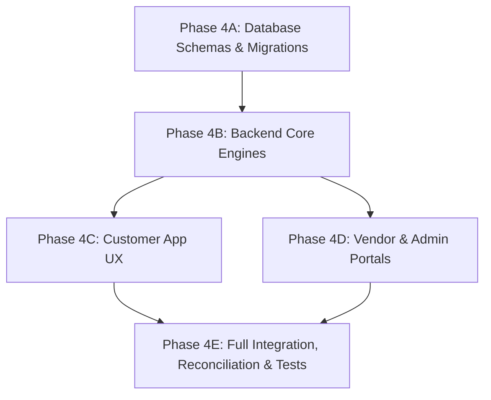

# DRIVEGO — PHASE 4 AUDIT
**Scope:** Trip Extension (Feature 10) + Delivery/Pickup (Feature 26) + Additional Driver (Feature 29)  
**Audit Date:** August 16, 2026  
**Status:** Audit & Architectural Blueprint Only (No Code Modifications Performed)  
**Benchmark Booking Safety:** `cmsu5sk3m000qgw1zaf9ftksz` (`CONFIRMED` / `PAID` / `NONE`)

---

## 1. Master Roadmap Context & Scope

DriveGo has 36 roadmap features.
- **Already Completed & Hardened:**
  - Features 1–9 (Coupons, Deposit Configuration, Customer KYC, Inspections, Handover, Return, Booking State Machine)
  - Features 11–14 (Cancellations, Vendor Operations, Payouts, GST Tax Invoices)
  - Features 18–22, 24–25, 27, 31–35 (Observability, Reviews, Availability Calendar, Multi-City Baseline, Reconciliation, RBAC)
  - Phase 3 Financial Invoicing & Security Deposit Infrastructure
- **Phase 4 Target Features Only:**
  1. **Feature 10: Trip Extension**
  2. **Feature 26: Delivery / Pickup (Add-on Service for `SELF_DRIVE` and `OUTSTATION`)**
  3. **Feature 29: Additional Driver (Normalized Model, KYC Verification & Fee Management)**

> [!IMPORTANT]
> **Trip Type Guard:** `SELF_DRIVE` and `OUTSTATION` are ACTIVE. `LOCAL` and `AIRPORT_TRANSFER` REMAIN COMING SOON / DISABLED. Feature 26 (Delivery/Pickup) is strictly an operational Add-on service and must NOT activate `LOCAL` or `AIRPORT_TRANSFER`.

---

## 2. Feature 10 — Trip Extension Audit & Lifecycle Design

### 2.1 Current State Analysis
- **Database:** `Booking` has `startDate` and `endDate`. No `TripExtension` model currently exists.
- **Backend:** `bookings.service.ts` validates overlapping bookings during `createBooking` using `startDate < end AND endDate > start`, but lacks an endpoint to extend an existing `ONGOING` booking.
- **Customer App:** `BookingDetailPage` shows booking details and status, but lacks an "Extend Trip" modal or extension payment trigger.
- **Financial Architecture:** Original `Payment` and `Invoice` records are immutable once confirmed. Extending a booking must NOT corrupt historical payment records.

### 2.2 Complete Trip Extension Lifecycle
1. **Eligibility State Guard:**
   - Allowed ONLY when `Booking.status === ONGOING` (and within 4 hours of scheduled end time).
   - Strictly forbidden when `Booking.status` is `PENDING`, `CANCELLED`, `COMPLETED`, `REFUNDED`, `DISPUTED`, or `EXPIRED`.
2. **Double-Booking & Conflict Prevention:**
   - Extended window: `(current Booking.endDate) -> (new requested endDate)`.
   - Acquire pessimistic PostgreSQL row lock on the Car:
     ```sql
     SELECT id FROM "Car" WHERE id = $carId FOR UPDATE;
     ```
   - Check `car.blockedDates` overlapping `(current endDate, new endDate)`.
   - Check conflicting future bookings for the same `carId` with status `[PENDING, CONFIRMED, ONGOING, HANDOVER_READY]` where `startDate < newEndDate AND endDate > currentEndDate`.
3. **Authoritative Extension Pricing:**
   - Extension duration: $\Delta t = \text{newEndDate} - \text{currentEndDate}$.
   - Additional Base Fare: calculated from `Car.pricePerDay` (or `pricePerHour` if applicable).
   - Platform Commission: standard commission percentage resolved for city/trip-type.
   - GST (18%): applied to platform fee portion.
   - Net to Vendor: additional base fare credited to vendor payout ledger.
   - Security Deposit: **0 additional deposit**. The existing security deposit in escrow remains `HELD`.
   - Coupons: Original booking coupon does **NOT** automatically re-apply to extension fees.
4. **Payment & Invoicing Architecture:**
   - Dedicated model `TripExtension` with states: `PENDING_PAYMENT`, `CONFIRMED`, `CANCELLED`, `EXPIRED`.
   - Creates a distinct Razorpay payment order for `extensionTotalFare`.
   - Upon payment verification (`POST /bookings/:id/extensions/:extId/verify`):
     - `TripExtension` transitions to `CONFIRMED`.
     - `Booking.endDate` is atomically extended to `newEndDate`.
     - A supplementary GST Tax Invoice is generated: `INV-YYYY-MM-XXXXX` linked to the extension payment.
     - Audit log emitted: `TRIP_EXTENDED`.
     - Push notifications sent to Customer and Vendor.

---

## 3. Feature 26 — Delivery / Pickup (Home Delivery & Airport Pickup Add-On) Audit

### 3.1 Current State Analysis
- **Current Booking Model:** Has plain string fields `pickupLocation` and `dropLocation`.
- **Constraint Compliance:** Must operate as an optional add-on for `SELF_DRIVE` and `OUTSTATION` rentals.

### 3.2 Architectural Blueprint
- **Normalized Data Model:**
  ```prisma
  enum DeliveryType {
    NONE
    DOORSTEP_DELIVERY
    DOORSTEP_PICKUP
    ROUND_TRIP_DELIVERY
  }
  ```
  Add delivery configuration fields to `Booking`:
  - `deliveryType DeliveryType @default(NONE)`
  - `deliveryAddress String?`
  - `deliveryLatitude Float?`
  - `deliveryLongitude Float?`
  - `deliveryFee Decimal @default(0) @db.Decimal(10, 2)`
  - `pickupAddress String?`
  - `pickupLatitude Float?`
  - `pickupLongitude Float?`
  - `pickupFee Decimal @default(0) @db.Decimal(10, 2)`
- **Distance & Fee Calculation:**
  - Vendor specifies delivery radius (e.g. up to 25 km from vendor hub).
  - City-configurable flat or distance-based fee (e.g., Mumbai doorstep delivery: ₹400; airport pickup: ₹600).
  - Included as an itemized line item in `Booking.deliveryFee` with 18% GST on platform service fee and remaining balance to vendor for delivery logistics.
- **Operational Workflow:**
  - Handover inspection occurs at the delivered customer address.
  - Return inspection and OTP verification occur at the customer pickup location.

---

## 4. Feature 29 — Additional Driver Audit

### 4.1 Current State Analysis
- `CustomerKyc` currently validates only the primary booking customer.
- No schema or backend support exists for secondary authorized drivers.

### 4.2 Architectural Blueprint
- **Normalized `AdditionalDriver` Model:**
  ```prisma
  model AdditionalDriver {
    id              String    @id @default(cuid())
    bookingId       String
    booking         Booking   @relation(fields: [bookingId], references: [id], onDelete: Cascade)
    fullName        String
    phone           String
    email           String?
    licenceNumber   String
    licenceFrontUrl String
    licenceBackUrl  String
    expiryDate      DateTime
    kycStatus       KycStatus @default(PENDING)
    rejectionReason String?
    verifiedAt      DateTime?
    feeAmount       Decimal   @default(0) @db.Decimal(10, 2)
    createdAt       DateTime  @default(now())
    updatedAt       DateTime  @updatedAt

    @@index([bookingId])
    @@index([licenceNumber])
    @@index([kycStatus])
  }
  ```
- **Business Rules & Verification:**
  - Limit: Maximum 2 additional drivers per rental.
  - Fee: Fixed nominal fee (e.g. ₹350/driver).
  - Eligibility: Must upload valid driving licence (front + back), age $\ge 21$, expiration date in the future.
  - Verification: Auto-verified if previously approved, or queued for Admin KYC verification.
  - Handover: Additional driver is authorized to operate the car; primary customer retains legal and financial liability for damage escrow.

---

## 5. Financial Safety & Concurrency Safeguards

| Feature | Financial Invariant | Concurrency & Race Condition Safeguard |
| :--- | :--- | :--- |
| **Trip Extension** | • Generates distinct `Payment` & `Invoice` without altering original booking payment.<br>• Zero duplicate security deposit.<br>• No coupon auto-bleed. | • `SELECT ... FOR UPDATE` on `Car` during extension validation.<br>• Atomic CAS update on `TripExtension.status` upon verification.<br>• Idempotent payment callback and reconciliation worker support. |
| **Delivery / Pickup** | • Delivery fee is an itemized line item in `totalFare`.<br>• 18% GST applies to platform fee portion.<br>• Cancellation prior to dispatch refunds delivery fee in full. | • Delivery address and coordinates locked upon booking confirmation.<br>• Immutable in historical invoice snapshot. |
| **Additional Driver** | • Fixed driver fee added to booking itemization.<br>• 18% GST applies on driver fee.<br>• KYC rejection allows driver replacement or fee refund prior to pickup. | • Relational foreign key to `Booking` with cascade.<br>• Deduplication index on `licenceNumber`. |

---

## 6. Multi-City Architecture & Isolation

1. **Trip Extension:**
   - Uses the vehicle's registered city pricing and commission rules. No inter-city fee leakage.
2. **Delivery / Pickup:**
   - City-specific delivery radius and fees (e.g. Mumbai doorstep ₹400, Delhi doorstep ₹500).
   - Handover coordinates verified against `SupportedCity` boundary.
3. **Additional Driver:**
   - Uniform KYC verification rules across all supported Indian cities (MoRTH / Parivahan standard driving licences).

---

## 7. Customer, Vendor & Admin UX Workflows

### 7.1 Customer UX
1. **Add-ons Step (`AddonsStep`):**
   - Toggle Doorstep Delivery: enter delivery address with map pin.
   - Toggle Additional Driver: enter driver name, phone, licence number, and upload licence photos.
2. **Booking Detail (`BookingDetailPage`):**
   - Active during `ONGOING` status: **"Extend Trip"** action card.
   - Modal lets customer choose new return date/time, displays calculated extension fare breakdown, and launches Razorpay checkout.
   - View itemized extension receipts and additional driver KYC badges.

### 7.2 Vendor UX (`VendorBookingDetailPage`)
1. **Ongoing Trips:**
   - View updated return schedule upon approved extension.
   - Real-time notification: *"Booking #XXXX extended until DD MMM, hh:mm"*.
2. **Delivery Orders:**
   - Delivery badge and customer doorstep address with directions link.
   - Pre-trip inspection performed on-site at customer location.
3. **Additional Drivers:**
   - View authorized driver names and verified driving licence cards.

### 7.3 Admin Panel (`AdminBookingManagementPage` & `AdminKycPage`)
1. View and filter trip extensions, additional driver KYC submissions, and delivery fees.
2. Adjudicate additional driver licence documents.
3. Access unified financial statements and extension invoices.

---

## 8. Master Dependency Map & Implementation Order



1. **Phase 4A: Database Schemas & Migrations**
   - `TripExtension`, `AdditionalDriver`, `Booking` delivery fields.
   - Formal migration file and Prisma client generation.
2. **Phase 4B: Backend Core Engines & APIs**
   - `TripExtensionsService` & Controller (`POST /bookings/:id/extensions/quote`, `POST /bookings/:id/extensions`, `POST /bookings/:id/extensions/:extId/verify`).
   - `AdditionalDriversService` & Controller (`POST /bookings/:id/additional-drivers`).
   - Delivery fee resolution in `FareCalculatorService` & `BookingsService`.
   - Invoicing hook for extension invoices.
3. **Phase 4C: Customer App UX**
   - Add-on step: Delivery location picker & Additional Driver input form.
   - Booking detail: "Extend Trip" bottom sheet with live pricing and Razorpay payment.
4. **Phase 4D: Vendor & Admin Portals**
   - Vendor App: Delivery address display, extension timeline update, authorized drivers list.
   - Admin Panel: Extension management, additional driver KYC adjudication.
5. **Phase 4E: Automated Tests & Financial Verification**
   - Jest unit test suites for `TripExtensionsService` and `AdditionalDriversService`.
   - Concurrency & double-booking collision tests.
   - Benchmark booking safety verification (`cmsu5sk3m000qgw1zaf9ftksz`).

---

## 9. Feature Classification Matrix

| Feature | Database | Backend | Customer UI | Vendor UI | Admin UI | Security / Financial | Overall Classification |
| :--- | :---: | :---: | :---: | :---: | :---: | :---: | :---: |
| **Feature 10: Trip Extension** | Missing | Missing | Missing | Missing | Missing | Needs Hardening | **C (Backend & UI Missing)** |
| **Feature 26: Delivery / Pickup** | Missing | Partial | Partial | Partial | Partial | Needs Hardening | **B (Partial Foundation)** |
| **Feature 29: Additional Driver** | Missing | Missing | Missing | Missing | Missing | Needs Hardening | **C (Backend & UI Missing)** |

---

## 10. Audit Conclusion

All 3 target features have been audited against the existing multi-city, payment, reconciliation, inspection, and invoicing foundations. A complete architectural blueprint is documented with zero regressions to the existing benchmark booking or payment contracts.

**Ready for implementation plan review.**
